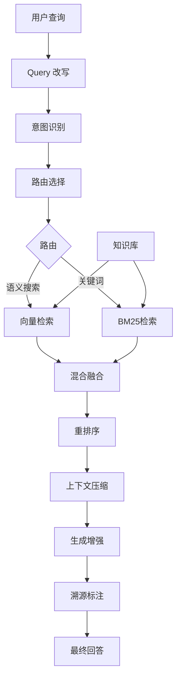

# 第 14 章：RAG 架构深度实践

> 本章深入探讨 RAG（检索增强生成）架构的高级实践，包括知识库构建优化、检索策略优化和生成质量提升。通过真实案例，帮助读者掌握企业级 RAG 系统的核心技术点。

## 本章内容提要

| 主题 | 核心技能 |
|------|----------|
| 知识库构建 | 文档解析、Chunk策略、增量更新 |
| 检索优化 | 混合检索、query扩展、MMR重排序 |
| 生成增强 | 上下文压缩、溯源标注、答案质量评估 |

---

## 14.1 RAG 架构进阶原理

### 14.1.1 为什么要深入 RAG？

基础 RAG（检索-生成）流程虽然简单，但企业在实际应用中会遇到诸多挑战：

- **召回质量差**：相关文档未被检索到
- **上下文过长**：输入 LLM 的 token 过多，成本高
- **生成幻觉**：模型基于不相关文档生成错误答案
- **实时性要求**：知识库频繁更新如何处理

本章将从工程实践角度逐一解决这些问题。

### 14.1.2 Advanced RAG 架构

Advanced RAG 在基础 RAG 基础上增加了多个优化层：



### 14.1.3 关键组件详解

| 组件 | 作用 | 常见实现 |
|------|------|----------|
| Query 改写 | 理解用户真实意图 | HyDE、query expansion |
| 路由选择 | 判断检索类型 | 意图分类模型 |
| 混合检索 | 结合向量和关键词 | RRF、加权融合 |
| 重排序 | 优化结果顺序 | Cross-encoder |
| 上下文压缩 | 减少 token 消耗 | LLMLingua、RAPTOR |
| 溯源标注 | 标明答案来源 | 引用格式 |

---

## 14.2 知识库构建与优化

### 14.2.1 文档解析最佳实践

不同格式的文档需要不同的解析策略：

```python
# src/rag/document_parser.py
from pathlib import Path
from typing import List, Dict
import re

class DocumentParser:
    """统一文档解析器"""
    
    def __init__(self):
        self.parsers = {
            '.pdf': self._parse_pdf,
            '.docx': self._parse_docx,
            '.txt': self._parse_txt,
            '.md': self._parse_markdown,
            '.html': self._parse_html,
        }
    
    def parse(self, file_path: str) -> List[Dict]:
        """解析文档并返回结构化内容"""
        path = Path(file_path)
        suffix = path.suffix.lower()
        
        if suffix not in self.parsers:
            raise ValueError(f"不支持的文件格式: {suffix}")
        
        content = self.parsers[suffix](path)
        return self._chunk_content(content)
    
    def _parse_pdf(self, path: Path) -> str:
        """PDF 解析（使用 PyMuPDF）"""
        import fitz  # PyMuPDF
        
        text_parts = []
        doc = fitz.open(str(path))
        
        for page_num, page in enumerate(doc):
            text = page.get_text()
            # 提取页码作为元数据
            text_parts.append(f"[页 {page_num + 1}]\n{text}")
        
        return "\n".join(text_parts)
    
    def _parse_docx(self, path: Path) -> str:
        """Word 文档解析"""
        from docx import Document
        
        doc = Document(str(path))
        paragraphs = []
        
        for para in doc.paragraphs:
            if para.text.strip():
                # 保留标题层级信息
                if para.style.name.startswith('Heading'):
                    level = para.style.name[-1]
                    paragraphs.append(f"\n{'#' * int(level)} {para.text}\n")
                else:
                    paragraphs.append(para.text)
        
        return "\n".join(paragraphs)
    
    def _parse_markdown(self, path: Path) -> str:
        """Markdown 解析 - 保留结构"""
        content = path.read_text(encoding='utf-8')
        # 移除代码块，避免干扰
        content = re.sub(r'```.*?```', '', content, flags=re.DOTALL)
        return content
    
    def _parse_txt(self, path: Path) -> str:
        """纯文本解析"""
        return path.read_text(encoding='utf-8')
    
    def _parse_html(self, path: Path) -> str:
        """HTML 解析"""
        from bs4 import BeautifulSoup
        
        soup = BeautifulSoup(path.read_text(encoding='utf-8'), 'html.parser')
        # 移除脚本和样式
        for tag in soup(['script', 'style', 'nav', 'footer']):
            tag.decompose()
        return soup.get_text(separator='\n', strip=True)
```

### 14.2.2 Chunk 策略优化

Chunk（分块）策略直接影响检索质量。以下是几种常用策略：

```python
# src/rag/chunker.py
from typing import List, Dict, Tuple
import re

class ChunkStrategy:
    """分块策略集合"""
    
    @staticmethod
    def fixed_size_chunk(
        text: str,
        chunk_size: int = 500,
        overlap: int = 50
    ) -> List[Dict]:
        """固定大小分块（字符数）"""
        chunks = []
        start = 0
        chunk_id = 0
        
        while start < len(text):
            end = start + chunk_size
            chunk_text = text[start:end]
            
            # 尝试在句号或换行处断开
            if end < len(text):
                break_point = max(
                    chunk_text.rfind('。'),
                    chunk_text.rfind('。'),
                    chunk_text.rfind('\n')
                )
                if break_point > chunk_size // 2:
                    chunk_text = chunk_text[:break_point + 1]
                    end = start + break_point + 1
            
            chunks.append({
                'chunk_id': f"chunk_{chunk_id}",
                'content': chunk_text.strip(),
                'start_pos': start,
                'end_pos': end,
                'token_count': len(chunk_text) // 4  # 粗略估算
            })
            
            start = end - overlap
            chunk_id += 1
        
        return chunks
    
    @staticmethod
    def semantic_chunk(
        text: str,
        max_tokens: int = 500,
        min_sentences: int = 2
    ) -> List[Dict]:
        """语义分块（按段落和语义边界）"""
        import nltk
        try:
            nltk.data.find('tokenizers/punkt')
        except LookupError:
            nltk.download('punkt', quiet=True)
        
        from nltk.tokenize import sent_tokenize
        
        sentences = sent_tokenize(text)
        chunks = []
        current_chunk = []
        current_tokens = 0
        chunk_id = 0
        
        for sentence in sentences:
            sentence_tokens = len(sentence) // 4
            current_tokens += sentence_tokens
            current_chunk.append(sentence)
            
            # 满足条件时创建新的 chunk
            if current_tokens >= max_tokens or \
               (len(current_chunk) >= min_sentences and 
                current_tokens >= max_tokens * 0.6):
                chunk_text = ' '.join(current_chunk)
                chunks.append({
                    'chunk_id': f"chunk_{chunk_id}",
                    'content': chunk_text.strip(),
                    'token_count': current_tokens,
                    'sentence_count': len(current_chunk)
                })
                current_chunk = []
                current_tokens = 0
                chunk_id += 1
        
        # 处理最后一个 chunk
        if current_chunk:
            chunks.append({
                'chunk_id': f"chunk_{chunk_id}",
                'content': ' '.join(current_chunk).strip(),
                'token_count': current_tokens,
                'sentence_count': len(current_chunk)
            })
        
        return chunks
    
    @staticmethod
    def hierarchical_chunk(
        text: str,
        heading_pattern: str = r'^(#{1,6})\s+(.+)$'
    ) -> List[Dict]:
        """层级分块（保留文档结构）"""
        lines = text.split('\n')
        chunks = []
        chunk_id = 0
        current_section = {'title': '', 'content': [], 'level': 0}
        
        for line in lines:
            match = re.match(heading_pattern, line)
            
            if match:
                # 保存之前的 section
                if current_section['content']:
                    content = '\n'.join(current_section['content'])
                    if content.strip():
                        chunks.append({
                            'chunk_id': f"chunk_{chunk_id}",
                            'title': current_section['title'],
                            'content': content.strip(),
                            'level': current_section['level'],
                            'token_count': len(content) // 4
                        })
                        chunk_id += 1
                
                # 开始新的 section
                level = len(match.group(1))
                title = match.group(2)
                current_section = {
                    'title': title,
                    'content': [],
                    'level': level
                }
            else:
                current_section['content'].append(line)
        
        # 保存最后一个 section
        if current_section['content']:
            content = '\n'.join(current_section['content'])
            if content.strip():
                chunks.append({
                    'chunk_id': f"chunk_{chunk_id}",
                    'title': current_section['title'],
                    'content': content.strip(),
                    'level': current_section['level'],
                    'token_count': len(content) // 4
                })
        
        return chunks
```

### 14.2.3 知识库增量更新策略

生产环境的知识库需要支持增量更新：

```python
# src/rag/knowledge_base.py
from datetime import datetime
from typing import List, Dict, Optional
from pathlib import Path
import hashlib
import json

class KnowledgeBase:
    """支持增量更新的知识库"""
    
    def __init__(self, storage_path: str):
        self.storage_path = Path(storage_path)
        self.storage_path.mkdir(parents=True, exist_ok=True)
        self.metadata_file = self.storage_path / "metadata.json"
        self.metadata = self._load_metadata()
    
    def _load_metadata(self) -> Dict:
        """加载元数据"""
        if self.metadata_file.exists():
            return json.loads(self.metadata_file.read_text())
        return {
            'documents': {},
            'last_update': None,
            'total_chunks': 0
        }
    
    def _save_metadata(self):
        """保存元数据"""
        self.metadata['last_update'] = datetime.now().isoformat()
        self.metadata_file.write_text(json.dumps(self.metadata, ensure_ascii=False, indent=2))
    
    def _compute_hash(self, content: str) -> str:
        """计算内容哈希"""
        return hashlib.md5(content.encode()).hexdigest()[:16]
    
    def add_document(
        self,
        doc_id: str,
        content: str,
        metadata: Optional[Dict] = None
    ) -> Dict:
        """添加文档（自动检测新增或更新）"""
        content_hash = self._compute_hash(content)
        
        is_new = doc_id not in self.metadata['documents']
        old_hash = self.metadata['documents'].get(doc_id, {}).get('hash')
        
        if not is_new and old_hash == content_hash:
            # 内容未变化，跳过
            return {
                'status': 'unchanged',
                'doc_id': doc_id,
                'chunks_added': 0
            }
        
        # 删除旧文档的 chunks（如果是更新）
        if not is_new:
            self._remove_document_chunks(doc_id)
        
        # 解析并分块
        from .chunker import ChunkStrategy
        chunks = ChunkStrategy.semantic_chunk(content)
        
        # 保存 chunks
        chunks_file = self.storage_path / f"{doc_id}_chunks.json"
        chunks_file.write_text(json.dumps(chunks, ensure_ascii=False))
        
        # 更新元数据
        self.metadata['documents'][doc_id] = {
            'hash': content_hash,
            'added_at': datetime.now().isoformat(),
            'chunk_count': len(chunks),
            'metadata': metadata or {}
        }
        self.metadata['total_chunks'] = sum(
            d['chunk_count'] for d in self.metadata['documents'].values()
        )
        self._save_metadata()
        
        return {
            'status': 'added' if is_new else 'updated',
            'doc_id': doc_id,
            'chunks_added': len(chunks)
        }
    
    def _remove_document_chunks(self, doc_id: str):
        """删除文档的 chunks"""
        chunks_file = self.storage_path / f"{doc_id}_chunks.json"
        if chunks_file.exists():
            chunks_file.unlink()
    
    def delete_document(self, doc_id: str) -> bool:
        """删除文档"""
        if doc_id not in self.metadata['documents']:
            return False
        
        self._remove_document_chunks(doc_id)
        del self.metadata['documents'][doc_id]
        self.metadata['total_chunks'] = sum(
            d['chunk_count'] for d in self.metadata['documents'].values()
        )
        self._save_metadata()
        return True
    
    def get_all_chunks(self) -> List[Dict]:
        """获取所有 chunks"""
        all_chunks = []
        for doc_id in self.metadata['documents']:
            chunks_file = self.storage_path / f"{doc_id}_chunks.json"
            if chunks_file.exists():
                chunks = json.loads(chunks_file.read_text())
                for chunk in chunks:
                    chunk['doc_id'] = doc_id
                    all_chunks.append(chunk)
        return all_chunks
```

---

## 14.3 检索策略优化

### 14.3.1 混合检索实现

混合检索结合向量检索和关键词检索的优势：

```python
# src/rag/hybrid_retriever.py
from typing import List, Dict, Tuple
import numpy as np

class HybridRetriever:
    """混合检索器"""
    
    def __init__(
        self,
        vector_store,
        bm25_index,
        fusion_method: str = "rrf"
    ):
        self.vector_store = vector_store
        self.bm25_index = bm25_index
        self.fusion_method = fusion_method
    
    def retrieve(
        self,
        query: str,
        top_k: int = 10,
        alpha: float = 0.7  # 向量检索权重
    ) -> List[Dict]:
        """混合检索"""
        # 1. 向量检索
        vector_results = self.vector_store.similarity_search(
            query, k=top_k * 2
        )
        vector_scores = {
            r['chunk_id']: r['score'] 
            for r in vector_results
        }
        
        # 2. BM25 检索
        bm25_results = self.bm25_index.search(query, k=top_k * 2)
        bm25_scores = {
            r['chunk_id']: r['score'] 
            for r in bm25_results
        }
        
        # 3. 分数融合
        all_chunk_ids = set(vector_scores.keys()) | set(bm25_scores.keys())
        
        if self.fusion_method == "rrf":
            # Reciprocal Rank Fusion
            fused_scores = self._rrf_fusion(
                vector_scores, bm25_scores, all_chunk_ids, alpha
            )
        else:
            # 加权分数融合
            fused_scores = self._weighted_fusion(
                vector_scores, bm25_scores, all_chunk_ids, alpha
            )
        
        # 4. 排序并返回
        sorted_chunks = sorted(
            fused_scores.items(),
            key=lambda x: x[1],
            reverse=True
        )[:top_k]
        
        # 构建最终结果
        chunk_id_to_result = {r['chunk_id']: r for r in vector_results}
        chunk_id_to_result.update({r['chunk_id']: r for r in bm25_results})
        
        results = []
        for chunk_id, score in sorted_chunks:
            if chunk_id in chunk_id_to_result:
                result = chunk_id_to_result[chunk_id]
                result['fusion_score'] = score
                results.append(result)
        
        return results
    
    def _rrf_fusion(
        self,
        vector_scores: Dict,
        bm25_scores: Dict,
        chunk_ids: set,
        alpha: float,
        k: int = 60
    ) -> Dict[str, float]:
        """Reciprocal Rank Fusion"""
        fused = {}
        
        # 归一化分数
        max_vec = max(vector_scores.values()) if vector_scores else 1
        max_bm25 = max(bm25_scores.values()) if bm25_scores else 1
        
        for chunk_id in chunk_ids:
            vec_score = vector_scores.get(chunk_id, 0) / max_vec
            bm25_score = bm25_scores.get(chunk_id, 0) / max_bm25
            
            # 加权 RRF
            rrf_score = alpha * vec_score + (1 - alpha) * bm25_score
            fused[chunk_id] = rrf_score
        
        return fused
    
    def _weighted_fusion(
        self,
        vector_scores: Dict,
        bm25_scores: Dict,
        chunk_ids: set,
        alpha: float
    ) -> Dict[str, float]:
        """加权分数融合"""
        fused = {}
        
        max_vec = max(vector_scores.values()) if vector_scores else 1
        max_bm25 = max(bm25_scores.values()) if bm25_scores else 1
        
        for chunk_id in chunk_ids:
            vec_score = vector_scores.get(chunk_id, 0) / max_vec
            bm25_score = bm25_scores.get(chunk_id, 0) / max_bm25
            fused[chunk_id] = alpha * vec_score + (1 - alpha) * bm25_score
        
        return fused
```

### 14.3.2 Query 扩展与改写

使用 HyDE（Hypothetical Document Embeddings）技术提升检索效果：

```python
# src/rag/query_expander.py
from typing import List

class QueryExpander:
    """查询扩展器"""
    
    def __init__(self, llm_client):
        self.llm = llm_client
    
    def expand_hyde(self, query: str) -> List[str]:
        """HyDE: 让 LLM 生成假设性答案，再检索"""
        hyde_prompt = f"""请针对以下用户问题，生成一个假设性的高质量回答。
这个回答是用于改进检索效果的示例，不需要真实正确。

用户问题: {query}

请生成1-2个不同角度的假设性回答，每个回答50-100字:"""

        response = self.llm.chat([{
            'role': 'user',
            'content': hyde_prompt
        }])
        
        # 解析假设性回答
        hypotheses = [query]  # 原始查询
        for line in response.split('\n'):
            if line.strip() and len(line) > 20:
                hypotheses.append(line.strip())
        
        return hypotheses[:3]
    
    def expand_subqueries(self, query: str) -> List[str]:
        """将复杂查询分解为多个子查询"""
        decompose_prompt = f"""将以下复杂查询分解为2-4个简单的子查询，每个子查询关注一个方面。

原始查询: {query}

分解后的子查询（每行一个，不要编号）:"""

        response = self.llm.chat([{
            'role': 'user',
            'content': decompose_prompt
        }])
        
        subqueries = []
        for line in response.split('\n'):
            line = line.strip().lstrip('0123456789.、）)')
            if line and len(line) > 5:
                subqueries.append(line)
        
        return subqueries if subqueries else [query]
    
    def expand_keywords(self, query: str) -> List[str]:
        """关键词扩展（同义词、近义词）"""
        keyword_prompt = f"""为以下查询提取关键词，并提供2-3个同义词或相关术语。

查询: {query}

格式:
关键词1: xxx, 同义词: xxx, xxx
关键词2: xxx, 同义词: xxx, xxx"""

        response = self.llm.chat([{
            'role': 'user',
            'content': keyword_prompt
        }])
        
        # 提取关键词
        keywords = []
        for line in response.split('\n'):
            if ':' in line:
                keyword = line.split(':')[1].split(',')[0].strip()
                keywords.append(keyword)
        
        # 返回原始查询 + 关键词组合
        expanded = [query]
        for kw in keywords[:3]:
            expanded.append(f"{query} {kw}")
        
        return expanded
```

### 14.3.3 MMR 重排序

MMR（Maximum Marginal Relevance）确保结果多样性：

```python
# src/rag/mmr_reranker.py
import numpy as np
from typing import List, Dict

class MMRReranker:
    """MMR 重排序"""
    
    def __init__(self, reranker_model=None):
        self.reranker = reranker_model
    
    def rerank(
        self,
        query: str,
        candidates: List[Dict],
        top_k: int = 5,
        lambda_param: float = 0.5
    ) -> List[Dict]:
        """MMR 重排序
        
        Args:
            query: 查询文本
            candidates: 候选文档列表
            top_k: 返回数量
            lambda_param: 相似度权重 (1-λ) 控制多样性
        """
        if not candidates:
            return []
        
        if self.reranker:
            return self._cross_encoder_rerank(
                query, candidates, top_k
            )
        
        return self._mmr_rerank(
            query, candidates, top_k, lambda_param
        )
    
    def _cross_encoder_rerank(
        self,
        query: str,
        candidates: List[Dict],
        top_k: int
    ) -> List[Dict]:
        """使用 Cross-Encoder 重排序"""
        pairs = [(query, c['content']) for c in candidates]
        scores = self.reranker.predict(pairs)
        
        for i, c in enumerate(candidates):
            c['rerank_score'] = float(scores[i])
        
        return sorted(candidates, key=lambda x: x['rerank_score'], reverse=True)[:top_k]
    
    def _mmm_rerank(
        self,
        query: str,
        candidates: List[Dict],
        top_k: int,
        lambda_param: float
    ) -> List[Dict]:
        """MMR 算法"""
        selected = []
        remaining = candidates.copy()
        
        query_embedding = self._get_embedding(query)
        query_norm = query_embedding / np.linalg.norm(query_embedding)
        
        while len(selected) < top_k and remaining:
            best_score = -float('inf')
            best_candidate = None
            
            for candidate in remaining:
                # 与查询的相似度
                doc_embedding = self._get_embedding(candidate['content'])
                doc_norm = doc_embedding / np.linalg.norm(doc_embedding)
                sim_to_query = float(np.dot(query_norm, doc_norm))
                
                # 与已选文档的最大相似度（惩罚重复内容）
                max_sim_to_selected = 0
                if selected:
                    selected_embeddings = [
                        self._get_embedding(s['content'])
                        for s in selected
                    ]
                    for sel_emb in selected_embeddings:
                        sel_norm = sel_emb / np.linalg.norm(sel_emb)
                        sim = float(np.dot(doc_norm, sel_norm))
                        max_sim_to_selected = max(max_sim_to_selected, sim)
                
                # MMR 分数
                mmr_score = lambda_param * sim_to_query - (1 - lambda_param) * max_sim_to_selected
                
                if mmr_score > best_score:
                    best_score = mmr_score
                    best_candidate = candidate
            
            if best_candidate:
                selected.append(best_candidate)
                remaining.remove(best_candidate)
        
        return selected
    
    def _get_embedding(self, text: str) -> np.ndarray:
        """获取文本 embedding（需要外部实现）"""
        raise NotImplementedError("需要接入 embedding 模型")
```

---

## 14.4 生成质量提升

### 14.4.1 上下文压缩

使用 LLMLingua 进行智能上下文压缩：

```python
# src/rag/context_compressor.py
from typing import List, Dict

class ContextCompressor:
    """上下文压缩器"""
    
    def __init__(self, llm_client):
        self.llm = llm_client
    
    def compress_context(
        self,
        query: str,
        context_chunks: List[Dict],
        max_tokens: int = 3000
    ) -> str:
        """压缩上下文，保留与查询相关的内容"""
        
        if not context_chunks:
            return ""
        
        # 构建上下文文本
        context_text = self._build_context_text(context_chunks)
        
        # 如果已经在 token 限制内，直接返回
        if len(context_text) // 4 <= max_tokens:
            return context_text
        
        # 使用 LLM 进行压缩
        compression_prompt = f"""你是一个上下文压缩专家。请从以下上下文中提取与问题最相关的部分，
生成一个精简但完整的答案上下文。

问题: {query}

原始上下文:
{context_text}

压缩要求:
1. 保留与问题直接相关的信息
2. 移除冗余的解释和重复内容
3. 保持上下文逻辑连贯
4. 目标长度: {max_tokens} tokens 以内

压缩后的上下文:"""

        compressed = self.llm.chat([{
            'role': 'user',
            'content': compression_prompt
        }])
        
        return compressed.strip()
    
    def _build_context_text(self, chunks: List[Dict]) -> str:
        """构建带溯源的上下文文本"""
        parts = []
        for i, chunk in enumerate(chunks, 1):
            source = chunk.get('source', chunk.get('doc_id', 'unknown'))
            title = chunk.get('title', '')
            
            part = f"[文档 {i}] 来源: {source}"
            if title:
                part += f" | 标题: {title}"
            part += f"\n{chunk['content']}\n"
            parts.append(part)
        
        return "\n---\n".join(parts)
    
    def extract_relevant_snippets(
        self,
        query: str,
        chunks: List[Dict],
        snippets_per_chunk: int = 2
    ) -> List[Dict]:
        """从每个 chunk 中提取相关片段"""
        extraction_prompt = f"""从以下文档中提取与问题最相关的片段。
只返回相关片段，不要解释。

问题: {query}

文档:
{{doc_content}}

相关片段（最多{snippets_per_chunk}个，每个不超过100字）:"""

        snippets = []
        for chunk in chunks:
            response = self.llm.chat([{
                'role': 'user',
                'content': extraction_prompt.format(doc_content=chunk['content'])
            }])
            
            for line in response.split('\n'):
                if line.strip():
                    snippets.append({
                        'content': line.strip(),
                        'source': chunk.get('source', chunk.get('doc_id', '')),
                        'chunk_id': chunk.get('chunk_id', '')
                    })
        
        return snippets[:len(chunks) * snippets_per_chunk]
```

### 14.4.2 溯源标注与引用

生成答案时自动添加来源引用：

```python
# src/rag/citation_generator.py
from typing import List, Dict, Tuple

class CitationGenerator:
    """引用生成器"""
    
    def __init__(self, llm_client):
        self.llm = llm_client
    
    def generate_with_citations(
        self,
        query: str,
        context_chunks: List[Dict]
    ) -> Tuple[str, List[Dict]]:
        """生成带引用的答案"""
        
        # 构建带编号的上下文
        cited_context = []
        for i, chunk in enumerate(context_chunks, 1):
            source = chunk.get('source', chunk.get('doc_id', f'来源{i}'))
            cited_context.append(
                f"[{i}] 来源: {source}\n{chunk['content']}"
            )
        
        context_text = "\n---\n".join(cited_context)
        
        # 带引用的生成 prompt
        generation_prompt = f"""基于以下参考资料回答用户问题。
在回答中使用 [1], [2] 等标注来引用相关来源。
如果某个信息没有明确的来源支持，不要编造，直接说明。

用户问题: {query}

参考资料:
{context_text}

要求:
1. 答案准确，基于参考资料
2. 使用 [编号] 标注每个声明的来源
3. 回答结束后，列出所有引用的来源
4. 如果参考资料不足以回答，说明情况"""

        answer = self.llm.chat([{
            'role': 'user',
            'content': generation_prompt
        }])
        
        # 解析引用的来源
        citations = self._extract_citations(answer, context_chunks)
        
        return answer, citations
    
    def _extract_citations(
        self,
        answer: str,
        chunks: List[Dict]
    ) -> List[Dict]:
        """从答案中提取引用的来源"""
        import re
        
        citations = []
        citation_numbers = re.findall(r'\[(\d+)\]', answer)
        
        for num in set(citation_numbers):
            idx = int(num) - 1
            if 0 <= idx < len(chunks):
                chunk = chunks[idx]
                citations.append({
                    'number': num,
                    'source': chunk.get('source', chunk.get('doc_id', '')),
                    'title': chunk.get('title', ''),
                    'content': chunk['content'][:200] + '...'
                })
        
        return citations
    
    def format_citations(self, citations: List[Dict]) -> str:
        """格式化引用列表"""
        if not citations:
            return ""
        
        lines = ["\n---\n**参考来源:**\n"]
        for cite in citations:
            title = cite.get('title', '')
            if title:
                lines.append(f"- [{cite['number']}] {title}")
            else:
                lines.append(f"- [{cite['number']}] {cite['source']}")
        
        return '\n'.join(lines)
```

### 14.4.3 答案质量评估

自动评估生成答案的质量：

```python
# src/rag/answer_evaluator.py
from typing import Dict, List

class AnswerEvaluator:
    """答案质量评估器"""
    
    def __init__(self, llm_client):
        self.llm = llm_client
    
    def evaluate(
        self,
        query: str,
        answer: str,
        context_chunks: List[Dict]
    ) -> Dict:
        """评估答案质量"""
        
        evaluation_prompt = f"""请评估以下 RAG 系统生成的答案质量。

问题: {query}

生成的答案:
{answer}

评估维度（每项 1-5 分）:
1. 答案完整性 - 是否完整回答了问题
2. 答案准确性 - 是否与参考资料一致
3. 上下文利用 - 是否有效利用了提供的参考资料
4. 答案简洁性 - 是否简洁明了，不过于冗长
5. 引用准确性 - 引用的来源是否正确支持答案

请以 JSON 格式返回评估结果:
{{
    "total_score": 总分,
    "breakdown": {{
        "completeness": 分数,
        "accuracy": 分数,
        "context_utilization": 分数,
        "conciseness": 分数,
        "citation_accuracy": 分数
    }},
    "issues": ["问题1", "问题2"],
    "suggestions": ["改进建议1"]
}}"""

        response = self.llm.chat([{
            'role': 'user',
            'content': evaluation_prompt
        }])
        
        return self._parse_evaluation(response)
    
    def _parse_evaluation(self, response: str) -> Dict:
        """解析评估结果"""
        import json
        import re
        
        # 尝试提取 JSON
        json_match = re.search(r'\{.*\}', response, re.DOTALL)
        if json_match:
            try:
                return json.loads(json_match.group())
            except json.JSONDecodeError:
                pass
        
        # 降级处理
        return {
            'total_score': 3,
            'breakdown': {
                'completeness': 3,
                'accuracy': 3,
                'context_utilization': 3,
                'conciseness': 3,
                'citation_accuracy': 3
            },
            'raw_response': response
        }
```

---

## 14.5 完整 RAG 流水线

### 14.5.1 高级 RAG 流程实现

整合以上所有组件：

```python
# src/rag/advanced_rag.py
from typing import List, Dict, Optional

class AdvancedRAG:
    """高级 RAG 系统"""
    
    def __init__(
        self,
        llm_client,
        embedding_model,
        vector_store,
        bm25_index,
        reranker=None
    ):
        self.llm = llm_client
        self.embedding = embedding_model
        self.vector_store = vector_store
        self.bm25 = bm25_index
        self.reranker = MMRReranker(reranker)
        self.query_expander = QueryExpander(llm_client)
        self.compressor = ContextCompressor(llm_client)
        self.citation_generator = CitationGenerator(llm_client)
    
    def query(
        self,
        user_query: str,
        top_k: int = 10,
        return_citations: bool = True,
        max_context_tokens: int = 3000
    ) -> Dict:
        """完整查询流程"""
        
        # 1. Query 扩展
        expanded_queries = self.query_expander.expand_subqueries(user_query)
        
        # 2. 混合检索
        all_results = []
        for query in expanded_queries:
            results = self._hybrid_search(query, top_k)
            all_results.extend(results)
        
        # 3. 去重
        unique_results = self._deduplicate_results(all_results)
        
        # 4. MMR 重排序
        reranked = self.reranker.rerank(
            user_query,
            unique_results,
            top_k=10,
            lambda_param=0.5
        )
        
        # 5. 上下文压缩
        compressed_context = self.compressor.compress_context(
            user_query,
            reranked,
            max_tokens=max_context_tokens
        )
        
        # 6. 生成答案
        if return_citations:
            answer, citations = self.citation_generator.generate_with_citations(
                user_query,
                reranked
            )
        else:
            answer = self._generate_answer(user_query, compressed_context)
            citations = []
        
        return {
            'answer': answer,
            'citations': citations,
            'context_chunks': reranked,
            'query_expansions': expanded_queries
        }
    
    def _hybrid_search(
        self,
        query: str,
        top_k: int
    ) -> List[Dict]:
        """混合检索"""
        hybrid = HybridRetriever(
            self.vector_store,
            self.bm25,
            fusion_method="rrf"
        )
        return hybrid.retrieve(query, top_k=top_k, alpha=0.7)
    
    def _deduplicate_results(
        self,
        results: List[Dict]
    ) -> List[Dict]:
        """去重"""
        seen = set()
        unique = []
        
        for result in results:
            chunk_id = result.get('chunk_id')
            if chunk_id and chunk_id not in seen:
                seen.add(chunk_id)
                unique.append(result)
        
        return unique
    
    def _generate_answer(
        self,
        query: str,
        context: str
    ) -> str:
        """生成答案"""
        prompt = f"""基于以下上下文回答问题。如果上下文中没有相关信息，请说明。

问题: {query}

上下文:
{context}

回答:"""

        return self.llm.chat([{'role': 'user', 'content': prompt}])
```

### 14.5.2 使用示例

```python
# examples/advanced_rag_demo.py
from src.rag.advanced_rag import AdvancedRAG
from src.rag.knowledge_base import KnowledgeBase

# 初始化
rag = AdvancedRAG(
    llm_client=dashscope_client,
    embedding_model=embedding_model,
    vector_store=faiss_store,
    bm25_index=bm25_index,
    reranker=cross_encoder
)

# 查询
result = rag.query(
    "阿里云函数计算支持哪些触发器？",
    top_k=10,
    return_citations=True
)

print("答案:", result['answer'])
print("\n参考来源:")
for cite in result['citations']:
    print(f"  [{cite['number']}] {cite.get('title', cite['source'])}")
```

---

## 14.6 本章小结

本章深入探讨了 RAG 架构的高级实践：

| 主题 | 核心要点 |
|------|----------|
| **知识库构建** | 多种分块策略、增量更新机制、结构保留 |
| **检索优化** | 混合检索（向量+BM25）、Query 扩展、MMR 重排序 |
| **生成增强** | 上下文压缩、溯源引用、答案质量评估 |
| **系统集成** | 完整 Advanced RAG 流水线 |

### 进阶学习路径

1. **深入优化**：尝试不同的 embedding 模型、reranker
2. **评估体系**：建立完整的 RAG 评估基准
3. **生产部署**：添加缓存、限流、监控等工程能力

---

## 延伸阅读

- [Advanced RAG Patterns](https://arxiv.org/abs/2312.10997)
- [HyDE: Hypothetical Document Embeddings](https://arxiv.org/abs/2212.10496)
- [Corrective RAG](https://github.com/run-llama/llama_index/blob/main/docs/docs/use_cases/corrective_rag.md)
