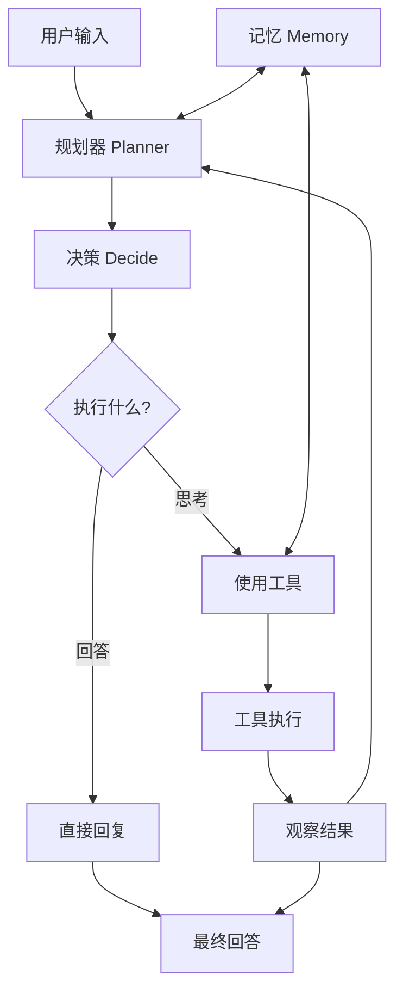
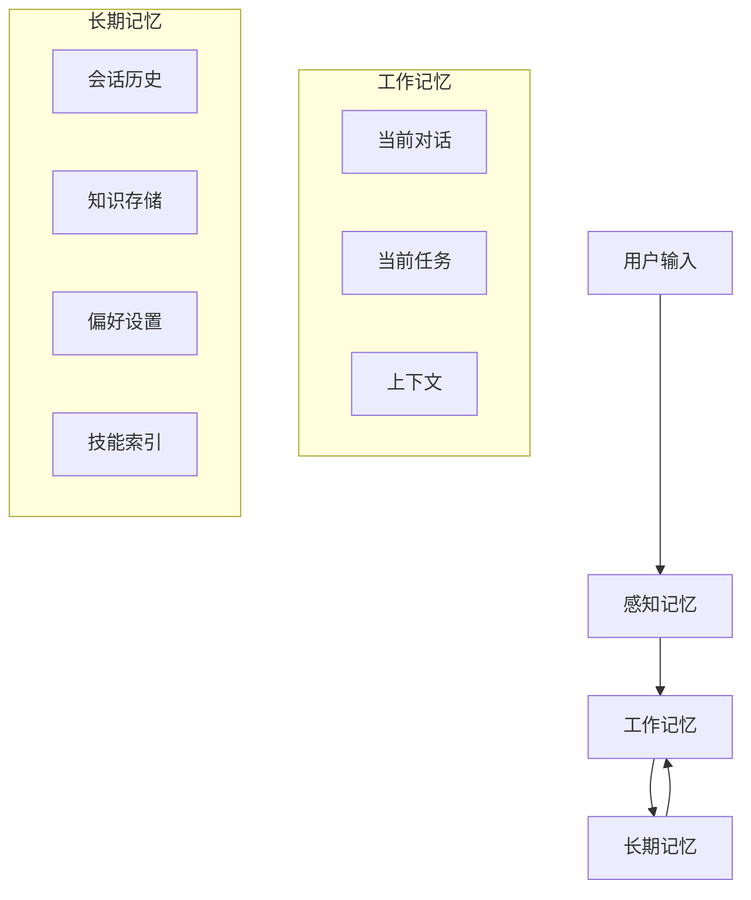
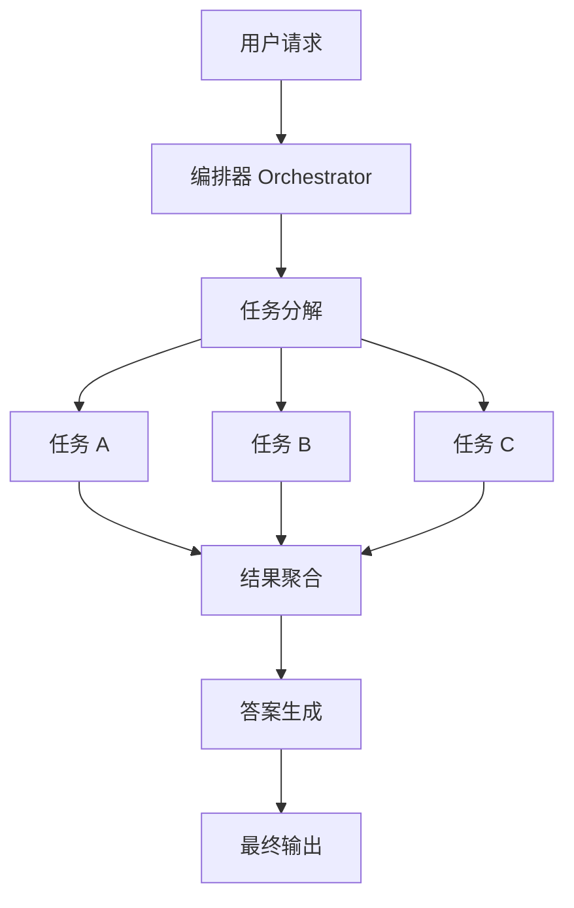

# 第 15 章：Agent 智能体开发

> 本章介绍 Agent（智能体）的核心概念、架构设计和开发实践。通过 DashScope 的 Function Calling 能力，构建能够自主规划、调用工具、与人协作的 AI Agent。

## 本章内容提要

| 主题 | 核心技能 |
|------|----------|
| Agent 基础 | 架构原理、ReAct 框架、自主决策 |
| 工具调用 | Function Calling、插件系统、工具注册 |
| 记忆管理 | 短期记忆、长期记忆、记忆检索 |
| 多 Agent 协作 | Agent 编排、任务分解、结果聚合 |

---

## 15.1 Agent 架构原理

### 15.1.1 什么是 Agent？

Agent（智能体）是一种能够感知环境、做出决策并执行行动的智能系统。与简单的 LLM 调用不同，Agent 具有：

- **自主性**：能够独立规划和执行任务
- **工具使用**：可以调用外部工具和 API
- **记忆能力**：能够记忆和利用历史信息
- **目标导向**：能够分解复杂任务并逐步完成



### 15.1.2 ReAct 框架详解

ReAct（Reasoning + Acting）是最经典的 Agent 框架之一：

```python
# src/agent/react.py
from typing import List, Dict, Any, Callable
from enum import Enum

class AgentAction(Enum):
    """Agent 可以执行的动作类型"""
    THINK = "think"      # 思考下一步
    ACT = "act"         # 执行工具
    OBSERVE = "observe" # 观察结果
    ANSWER = "answer"    # 生成最终答案

class ReActAgent:
    """基于 ReAct 框架的 Agent"""
    
    def __init__(
        self,
        llm_client,
        tools: List[Dict],
        max_iterations: int = 10
    ):
        self.llm = llm_client
        self.tools = tools
        self.max_iterations = max_iterations
        
        # 构建工具描述
        self.tool_descriptions = self._build_tool_description()
    
    def _build_tool_description(self) -> str:
        """构建工具描述字符串"""
        descriptions = []
        for i, tool in enumerate(self.tools):
            param_info = ", ".join([
                f"{p['name']}: {p['type']}"
                for p in tool.get('parameters', {}).get('properties', {}).values()
            ])
            descriptions.append(
                f"{i}. {tool['name']}: {tool['description']} (参数: {param_info})"
            )
        return "\n".join(descriptions)
    
    def run(self, user_input: str) -> Dict:
        """运行 Agent"""
        history = []
        context = ""
        
        for iteration in range(self.max_iterations):
            # 1. 生成思考
            thought = self._generate_thought(user_input, context, history)
            history.append({"role": "assistant", "content": thought})
            
            # 2. 决定下一步动作
            action = self._parse_action(thought)
            
            if action['type'] == 'answer':
                # 生成最终答案
                answer = self._generate_answer(user_input, context)
                return {
                    "answer": answer,
                    "thoughts": history,
                    "iterations": iteration + 1
                }
            
            elif action['type'] == 'tool':
                # 3. 执行工具
                tool_name = action['tool']
                tool_args = action['args']
                
                result = self._execute_tool(tool_name, tool_args)
                observation = f"观察结果: {result}"
                history.append({"role": "user", "content": observation})
                context += f"\n{observation}"
            
            else:  # think
                context += f"\n思考: {action['content']}"
        
        # 达到最大迭代次数
        return {
            "answer": "抱歉，我无法在规定步骤内完成任务。",
            "thoughts": history,
            "iterations": self.max_iterations
        }
    
    def _generate_thought(
        self,
        user_input: str,
        context: str,
        history: List[Dict]
    ) -> str:
        """生成思考和行动"""
        
        system_prompt = f"""你是一个能够自主思考和行动的 AI Agent。

当前时间: 2026-04-18

你拥有以下工具可以使用:
{self.tool_descriptions}

你必须按照以下格式思考和行动:

## 思考
分析当前情况，考虑是否需要使用工具来完成任务。

## 动作
根据思考结果，选择以下之一:
- tool: 使用工具。格式: tool: {{"tool": "工具名", "args": {{"参数": "值"}}}}
- answer: 直接回答用户问题。格式: answer: [你的回答]
- think: 继续思考。格式: think: [你的思考内容]

## 历史对话
{context if context else "无"}

## 用户问题
{user_input}

请开始推理:"""

        response = self.llm.chat([
            {"role": "system", "content": system_prompt}
        ])
        
        return response
    
    def _parse_action(self, thought: str) -> Dict:
        """解析思考内容中的动作"""
        import json
        import re
        
        # 查找动作指令
        patterns = [
            (r'tool:\s*(\{{[^}}]+\}})', 'tool'),
            (r'think:\s*(.+)', 'think'),
            (r'answer:\s*(.+)', 'answer'),
        ]
        
        for pattern, action_type in patterns:
            match = re.search(pattern, thought, re.DOTALL)
            if match:
                if action_type == 'tool':
                    try:
                        args = json.loads(match.group(1))
                        return {"type": "tool", "tool": args.get("tool"), "args": args.get("args", {})}
                    except:
                        return {"type": "think", "content": thought}
                elif action_type == 'think':
                    return {"type": "think", "content": match.group(1)}
                else:  # answer
                    return {"type": "answer", "content": match.group(1)}
        
        return {"type": "think", "content": thought}
    
    def _execute_tool(self, tool_name: str, args: Dict) -> Any:
        """执行工具"""
        for tool in self.tools:
            if tool['name'] == tool_name:
                return tool['function'](**args)
        
        return f"错误: 找不到工具 '{tool_name}'"
    
    def _generate_answer(
        self,
        user_input: str,
        context: str
    ) -> str:
        """生成最终答案"""
        prompt = f"""基于之前的推理过程，给出最终答案。

用户问题: {user_input}

推理过程:
{context}

请给出完整、准确的回答:"""

        return self.llm.chat([{"role": "user", "content": prompt}])
```

### 15.1.3 Agent 与 LLM 的区别

| 特性 | 纯 LLM | Agent |
|------|--------|-------|
| 输入 | 当前对话 | 当前 + 历史 + 环境 |
| 输出 | 文本 | 思考 + 动作 + 文本 |
| 工具使用 | 无 | 有 |
| 多步推理 | 有限 | 完整 |
| 记忆能力 | 对话窗口 | 可扩展存储 |

---

## 15.2 Function Calling 实践

### 15.2.1 DashScope Function Calling

DashScope 支持 Function Calling，可以定义工具让模型调用：

```python
# src/agent/tools/dashscope_tools.py
from typing import List, Dict, Any, Callable
import json

class DashScopeFunctionCaller:
    """DashScope Function Calling 封装"""
    
    def __init__(self, llm_client):
        self.llm = llm_client
        self.registered_tools: Dict[str, Callable] = {}
    
    def register_tool(
        self,
        name: str,
        description: str,
        parameters: Dict,
        function: Callable
    ):
        """注册工具"""
        self.registered_tools[name] = function
        
        # 构建函数定义
        if 'functions' not in self.__dict__:
            self.functions = []
        
        self.functions.append({
            "name": name,
            "description": description,
            "parameters": parameters
        })
    
    def chat_with_functions(
        self,
        messages: List[Dict],
        functions: List[Dict] = None
    ) -> Dict:
        """调用 LLM，支持函数调用"""
        if functions is None:
            functions = self.functions
        
        response = self.llm.chat(
            messages,
            functions=functions if functions else None
        )
        
        return response
    
    def run_with_tools(
        self,
        user_input: str,
        max_turns: int = 5
    ) -> Dict:
        """带工具调用的对话"""
        messages = [{"role": "user", "content": user_input}]
        iterations = 0
        
        while iterations < max_turns:
            # 调用 LLM
            response = self.chat_with_functions(messages)
            
            if response.get('function_call'):
                # 解析函数调用
                func_name = response['function_call']['name']
                func_args = json.loads(response['function_call']['arguments'])
                
                # 添加助手消息
                messages.append({
                    "role": "assistant",
                    "content": response.get('output') or "",
                    "function_call": {
                        "name": func_name,
                        "arguments": response['function_call']['arguments']
                    }
                })
                
                # 执行函数
                if func_name in self.registered_tools:
                    func_result = self.registered_tools[func_name](**func_args)
                else:
                    func_result = f"错误: 未知函数 {func_name}"
                
                # 添加函数结果
                messages.append({
                    "role": "function",
                    "name": func_name,
                    "content": str(func_result)
                })
                
                iterations += 1
            else:
                # 无函数调用，直接返回
                return {
                    "answer": response.get('output', response.get('text', '')),
                    "iterations": iterations,
                    "function_calls": []
                }
        
        return {
            "answer": "已达到最大迭代次数",
            "iterations": iterations
        }
```

### 15.2.2 常用工具定义

以下是几个常用的工具定义示例：

```python
# 定义搜索工具
search_tool = {
    "name": "search_knowledge_base",
    "description": "搜索知识库获取相关信息。当用户询问具体知识点、产品功能、政策法规等内容时使用。",
    "parameters": {
        "type": "object",
        "properties": {
            "query": {
                "type": "string",
                "description": "搜索查询词"
            },
            "top_k": {
                "type": "integer",
                "description": "返回结果数量，默认 5",
                "default": 5
            }
        },
        "required": ["query"]
    }
}

# 定义数据库查询工具
db_query_tool = {
    "name": "query_database",
    "description": "查询数据库获取结构化数据。用于用户询问具体数据、数值、统计信息时使用。",
    "parameters": {
        "type": "object",
        "properties": {
            "sql": {
                "type": "string",
                "description": "SQL 查询语句"
            },
            "params": {
                "type": "object",
                "description": "查询参数"
            }
        },
        "required": ["sql"]
    }
}

# 定义计算工具
calculator_tool = {
    "name": "calculate",
    "description": "执行数学计算。用于需要精确计算的场景，如费用计算、统计分析等。",
    "parameters": {
        "type": "object",
        "properties": {
            "expression": {
                "type": "string",
                "description": "数学表达式，如 '100 * 0.05 * 30'"
            }
        },
        "required": ["expression"]
    }
}

# 定义发送通知工具
notification_tool = {
    "name": "send_notification",
    "description": "发送通知给用户。支持邮件、短信、应用内通知。",
    "parameters": {
        "type": "object",
        "properties": {
            "channel": {
                "type": "string",
                "enum": ["email", "sms", "app"],
                "description": "通知渠道"
            },
            "recipient": {
                "type": "string",
                "description": "接收人标识"
            },
            "title": {
                "type": "string",
                "description": "通知标题"
            },
            "content": {
                "type": "string",
                "description": "通知内容"
            }
        },
        "required": ["channel", "recipient", "content"]
    }
}
```

### 15.2.3 工具执行函数实现

```python
# 工具函数实现
def search_knowledge_base(query: str, top_k: int = 5) -> str:
    """知识库搜索实现"""
    from your_rag_module import KnowledgeBase
    
    kb = KnowledgeBase("/path/to/knowledge_base")
    results = kb.search(query, top_k=top_k)
    
    if not results:
        return "未找到相关信息"
    
    formatted = []
    for i, r in enumerate(results, 1):
        formatted.append(f"{i}. {r['content'][:200]}...")
    
    return "\n".join(formatted)


def query_database(sql: str, params: dict = None) -> str:
    """数据库查询实现"""
    import sqlite3
    
    conn = sqlite3.connect("/path/to/database.db")
    cursor = conn.cursor()
    
    try:
        cursor.execute(sql, params or {})
        rows = cursor.fetchall()
        columns = [desc[0] for desc in cursor.description]
        
        if not rows:
            return "查询结果为空"
        
        # 格式化结果
        result = [f"列: {', '.join(columns)}"]
        for row in rows[:10]:  # 限制返回行数
            result.append(", ".join(str(v) for v in row))
        
        return "\n".join(result)
    finally:
        conn.close()


def calculate(expression: str) -> str:
    """数学计算实现"""
    import math
    import operator
    
    # 安全计算（限制可用函数）
    safe_dict = {
        "abs": abs,
        "round": round,
        "min": min,
        "max": max,
        "sum": sum,
        "pow": pow,
        "pi": math.pi,
        "e": math.e,
        "sqrt": math.sqrt,
        "sin": math.sin,
        "cos": math.cos,
        "log": math.log,
    }
    
    try:
        result = eval(expression, {"__builtins__": {}}, safe_dict)
        return f"计算结果: {result}"
    except Exception as e:
        return f"计算错误: {str(e)}"


def send_notification(
    channel: str,
    recipient: str,
    title: str,
    content: str
) -> str:
    """发送通知实现"""
    if channel == "email":
        # 使用邮件服务发送
        return f"邮件已发送给 {recipient}: {title}"
    elif channel == "sms":
        return f"短信已发送给 {recipient}"
    elif channel == "app":
        return f"应用通知已发送给 {recipient}"
    else:
        return f"不支持的通知渠道: {channel}"
```

---

## 15.3 Agent 记忆管理

### 15.3.1 记忆系统架构

Agent 需要管理多种类型的记忆：



### 15.3.2 记忆实现

```python
# src/agent/memory.py
from typing import List, Dict, Any, Optional
from datetime import datetime
import json
from pathlib import Path

class AgentMemory:
    """Agent 记忆系统"""
    
    def __init__(self, storage_path: Optional[str] = None):
        self.storage_path = Path(storage_path) if storage_path else None
        if self.storage_path:
            self.storage_path.mkdir(parents=True, exist_ok=True)
        
        # 工作记忆（当前上下文）
        self.working_memory = {
            'conversation': [],
            'current_task': None,
            'context': {}
        }
        
        # 长期记忆索引
        self.memory_index = {
            'episodes': [],      # 情节记忆
            'knowledge': [],      # 知识
            'preferences': {},    # 偏好
            'skills': []          # 技能
        }
        
        self._load_memory()
    
    def _load_memory(self):
        """加载持久化的记忆"""
        if self.storage_path and (self.storage_path / "memory.json").exists():
            with open(self.storage_path / "memory.json") as f:
                self.memory_index = json.load(f)
    
    def _save_memory(self):
        """保存记忆到磁盘"""
        if self.storage_path:
            with open(self.storage_path / "memory.json", "w") as f:
                json.dump(self.memory_index, f, ensure_ascii=False, indent=2)
    
    # ========== 工作记忆 ==========
    
    def add_working_memory(self, role: str, content: str):
        """添加到工作记忆"""
        self.working_memory['conversation'].append({
            'role': role,
            'content': content,
            'timestamp': datetime.now().isoformat()
        })
    
    def get_conversation_context(
        self,
        max_turns: int = 10
    ) -> List[Dict]:
        """获取最近对话上下文"""
        return self.working_memory['conversation'][-max_turns:]
    
    def set_current_task(self, task: str):
        """设置当前任务"""
        self.working_memory['current_task'] = {
            'task': task,
            'started_at': datetime.now().isoformat(),
            'steps': []
        }
    
    def add_task_step(self, step: str):
        """添加任务步骤"""
        if self.working_memory['current_task']:
            self.working_memory['current_task']['steps'].append({
                'step': step,
                'timestamp': datetime.now().isoformat()
            })
    
    def get_task_progress(self) -> str:
        """获取任务进度"""
        task = self.working_memory.get('current_task')
        if not task:
            return "无进行中的任务"
        
        steps = task.get('steps', [])
        return f"任务: {task['task']}\n进度: {len(steps)} 步骤已完成"
    
    # ========== 长期记忆 ==========
    
    def store_episode(
        self,
        situation: str,
        action: str,
        result: str,
        reflection: Optional[str] = None
    ):
        """存储情节记忆"""
        episode = {
            'type': 'episode',
            'situation': situation,
            'action': action,
            'result': result,
            'reflection': reflection,
            'created_at': datetime.now().isoformat(),
            'access_count': 0
        }
        self.memory_index['episodes'].append(episode)
        self._save_memory()
    
    def store_knowledge(
        self,
        topic: str,
        content: str,
        source: Optional[str] = None
    ):
        """存储知识"""
        # 检查是否已存在
        for item in self.memory_index['knowledge']:
            if item['topic'] == topic:
                item['content'] = content
                item['updated_at'] = datetime.now().isoformat()
                self._save_memory()
                return
        
        # 新增知识
        self.memory_index['knowledge'].append({
            'type': 'knowledge',
            'topic': topic,
            'content': content,
            'source': source,
            'created_at': datetime.now().isoformat()
        })
        self._save_memory()
    
    def retrieve_memories(
        self,
        query: str,
        memory_types: List[str] = None,
        top_k: int = 5
    ) -> List[Dict]:
        """检索相关记忆（简化版，实际应该用 embedding）"""
        if memory_types is None:
            memory_types = ['episodes', 'knowledge']
        
        results = []
        
        for mem_type in memory_types:
            if mem_type == 'episodes':
                for ep in self.memory_index.get('episodes', []):
                    if query.lower() in ep['situation'].lower() or \
                       query.lower() in ep['action'].lower():
                        ep['access_count'] += 1
                        results.append(ep)
            
            elif mem_type == 'knowledge':
                for kw in self.memory_index.get('knowledge', []):
                    if query.lower() in kw['topic'].lower() or \
                       query.lower() in kw['content'].lower():
                        results.append(kw)
        
        # 按访问频率和相关性排序
        results.sort(key=lambda x: x.get('access_count', 0), reverse=True)
        return results[:top_k]
    
    def update_preference(self, key: str, value: Any):
        """更新偏好设置"""
        self.memory_index['preferences'][key] = value
        self._save_memory()
    
    def get_preference(self, key: str, default: Any = None) -> Any:
        """获取偏好设置"""
        return self.memory_index['preferences'].get(key, default)
    
    def summarize_and_consolidate(self, llm_client) -> str:
        """总结和整合记忆（定期调用）"""
        if not self.working_memory['conversation']:
            return "无需整合"
        
        # 提取关键信息
        summary_prompt = f"""总结以下对话中的关键信息，包括:
1. 用户的主要需求
2. 完成任务的关键步骤
3. 重要的中间结果
4. 最终答案

对话:
{json.dumps(self.working_memory['conversation'], ensure_ascii=False)}

总结（JSON格式）:"""

        summary = llm_client.chat([{"role": "user", "content": summary_prompt}])
        
        # 存储为情节记忆
        self.store_episode(
            situation=f"用户询问了关于{self.working_memory['conversation'][0]['content'][:50]}...",
            action="执行了多步推理",
            result=summary[:200],
            reflection="这是一个有效的解决方案"
        )
        
        # 清空当前对话
        self.working_memory['conversation'] = []
        
        return summary
```

---

## 15.4 工具注册与管理

### 15.4.1 工具注册中心

```python
# src/agent/tool_registry.py
from typing import Dict, Callable, List, Any
from dataclasses import dataclass
import json

@dataclass
class ToolDefinition:
    """工具定义"""
    name: str
    description: str
    parameters: Dict
    function: Callable
    tags: List[str] = None
    
    def __post_init__(self):
        if self.tags is None:
            self.tags = []

class ToolRegistry:
    """工具注册中心"""
    
    def __init__(self):
        self._tools: Dict[str, ToolDefinition] = {}
        self._tags: Dict[str, List[str]] = {}  # tag -> tool names
    
    def register(
        self,
        name: str,
        description: str,
        parameters: Dict,
        function: Callable,
        tags: List[str] = None
    ):
        """注册工具"""
        tool = ToolDefinition(
            name=name,
            description=description,
            parameters=parameters,
            function=function,
            tags=tags or []
        )
        
        self._tools[name] = tool
        
        # 更新标签索引
        for tag in tool.tags:
            if tag not in self._tags:
                self._tags[tag] = []
            self._tags[tag].append(name)
    
    def get_tool(self, name: str) -> ToolDefinition:
        """获取工具定义"""
        return self._tools.get(name)
    
    def get_all_tools(self) -> List[Dict]:
        """获取所有工具定义（用于 LLM）"""
        return [
            {
                "name": t.name,
                "description": t.description,
                "parameters": t.parameters
            }
            for t in self._tools.values()
        ]
    
    def get_tools_by_tag(self, tag: str) -> List[ToolDefinition]:
        """根据标签获取工具"""
        tool_names = self._tags.get(tag, [])
        return [self._tools[name] for name in tool_names]
    
    def execute(self, name: str, **kwargs) -> Any:
        """执行工具"""
        tool = self._tools.get(name)
        if not tool:
            raise ValueError(f"未知工具: {name}")
        
        return tool.function(**kwargs)
    
    def get_tool_schema(self) -> str:
        """获取工具 schema（用于文档生成）"""
        schemas = []
        for tool in self._tools.values():
            schema = {
                "name": tool.name,
                "description": tool.description,
                "parameters": tool.parameters
            }
            schemas.append(schema)
        
        return json.dumps(schemas, ensure_ascii=False, indent=2)


# 全局注册中心
_global_registry = ToolRegistry()

def get_registry() -> ToolRegistry:
    return _global_registry

def register_tool(
    description: str,
    parameters: Dict,
    tags: List[str] = None
):
    """装饰器注册工具"""
    def decorator(func: Callable):
        _global_registry.register(
            name=func.__name__,
            description=description,
            parameters=parameters,
            function=func,
            tags=tags
        )
        return func
    return decorator
```

### 15.4.2 工具使用示例

```python
# examples/agent_tools_demo.py
from src.agent.tool_registry import get_registry, register_tool

registry = get_registry()

# 注册工具
@register_tool(
    description="获取当前日期和时间",
    parameters={
        "type": "object",
        "properties": {},
        "required": []
    },
    tags=["utility", "time"]
)
def get_current_time():
    from datetime import datetime
    return datetime.now().strftime("%Y-%m-%d %H:%M:%S")

@register_tool(
    description="搜索互联网获取实时信息",
    parameters={
        "type": "object",
        "properties": {
            "query": {
                "type": "string",
                "description": "搜索关键词"
            }
        },
        "required": ["query"]
    },
    tags=["search"]
)
def web_search(query: str):
    # 实际实现调用搜索 API
    return f"搜索结果: 关于'{query}'的信息..."

@register_tool(
    description="发送邮件",
    parameters={
        "type": "object",
        "properties": {
            "to": {"type": "string", "description": "收件人邮箱"},
            "subject": {"type": "string", "description": "邮件主题"},
            "body": {"type": "string", "description": "邮件正文"}
        },
        "required": ["to", "subject", "body"]
    },
    tags=["communication"]
)
def send_email(to: str, subject: str, body: str):
    return f"邮件已发送给 {to}: {subject}"
```

---

## 15.5 多 Agent 协作

### 15.5.1 Agent 编排模式

复杂任务可以由多个 Agent 协作完成：



### 15.5.2 简单编排器实现

```python
# src/agent/orchestrator.py
from typing import List, Dict, Any, Callable
from dataclasses import dataclass
from concurrent.futures import ThreadPoolExecutor
import asyncio

@dataclass
class SubAgent:
    """子 Agent 定义"""
    name: str
    description: str
    system_prompt: str
    tools: List[Dict]
    executor: Callable  # 执行函数

class AgentOrchestrator:
    """Agent 编排器"""
    
    def __init__(self, llm_client):
        self.llm = llm_client
        self.agents: Dict[str, SubAgent] = {}
    
    def register_agent(self, agent: SubAgent):
        """注册子 Agent"""
        self.agents[agent.name] = agent
    
    async def orchestrate(
        self,
        task: str,
        agent_names: List[str] = None
    ) -> Dict:
        """编排任务执行"""
        
        # 1. 任务分析
        if agent_names is None:
            agent_names = self._route_task(task)
        
        # 2. 并行执行子任务
        results = await self._execute_parallel(task, agent_names)
        
        # 3. 聚合结果
        aggregated = self._aggregate_results(task, results)
        
        return {
            "task": task,
            "sub_results": results,
            "final_answer": aggregated
        }
    
    def _route_task(self, task: str) -> List[str]:
        """任务路由 - 确定需要哪些 Agent"""
        # 使用 LLM 判断
        prompt = f"""分析以下任务，确定需要哪些专业 Agent 协作完成。

任务: {task}

可用 Agent:
{self._list_agents()}

请列出需要的 Agent 名称（逗号分隔），每个任务建议 1-3 个 Agent:"""

        response = self.llm.chat([{"role": "user", "content": prompt}])
        
        # 解析响应，提取 Agent 名称
        agent_names = []
        for name in self.agents.keys():
            if name in response:
                agent_names.append(name)
        
        return agent_names if agent_names else ["general"]
    
    def _list_agents(self) -> str:
        """列出所有 Agent"""
        return "\n".join([
            f"- {name}: {agent.description}"
            for name, agent in self.agents.items()
        ])
    
    async def _execute_parallel(
        self,
        task: str,
        agent_names: List[str]
    ) -> Dict[str, Any]:
        """并行执行多个子 Agent"""
        results = {}
        
        async def run_agent(name: str):
            agent = self.agents.get(name)
            if not agent:
                return name, {"error": f"Agent {name} 不存在"}
            
            # 构建 Agent prompt
            full_prompt = f"{agent.system_prompt}\n\n任务: {task}"
            
            # 使用 ReAct 或直接调用
            result = await self._run_agent_task(agent, task)
            return name, result
        
        # 并发执行
        tasks = [run_agent(name) for name in agent_names]
        completed = await asyncio.gather(*tasks, return_exceptions=True)
        
        for item in completed:
            if isinstance(item, tuple):
                name, result = item
                results[name] = result
            elif isinstance(item, Exception):
                results["error"] = str(item)
        
        return results
    
    async def _run_agent_task(
        self,
        agent: SubAgent,
        task: str
    ) -> str:
        """运行单个 Agent 任务"""
        # 简化实现：直接调用 LLM
        messages = [
            {"role": "system", "content": agent.system_prompt},
            {"role": "user", "content": task}
        ]
        
        response = self.llm.chat(messages, functions=agent.tools)
        return response.get('output', str(response))
    
    def _aggregate_results(
        self,
        task: str,
        results: Dict[str, Any]
    ) -> str:
        """聚合子 Agent 结果"""
        # 构建聚合 prompt
        result_text = "\n\n".join([
            f"=== {name} 的结果 ===\n{result}"
            for name, result in results.items()
        ])
        
        aggregation_prompt = f"""基于以下多个 Agent 的分析结果，给出综合性的最终答案。

原始任务: {task}

各 Agent 分析:
{result_text}

要求:
1. 综合各方观点
2. 突出关键发现
3. 给出明确结论
4. 如有分歧，说明权衡

最终答案:"""

        return self.llm.chat([{"role": "user", "content": aggregation_prompt}])
```

### 15.5.3 协作示例：校园助手

```python
# examples/campus_assistant_orchestrator.py
from src.agent.orchestrator import AgentOrchestrator, SubAgent
from src.agent.tools.dashscope_tools import DashScopeFunctionCaller

# 创建编排器
orchestrator = AgentOrchestrator(dashscope_llm)

# 注册课程 Agent
orchestrator.register_agent(SubAgent(
    name="course_agent",
    description="课程咨询 Agent",
    system_prompt="你是一个课程顾问，专注于回答课程相关问题，包括选课、教学计划、课程内容等。",
    tools=[search_tool, get_course_info_tool],
    executor=None
))

# 注册图书馆 Agent
orchestrator.register_agent(SubAgent(
    name="library_agent",
    description="图书馆服务 Agent",
    system_prompt="你是一个图书馆助手，帮助查找图书、期刊、数据库资源。",
    tools=[search_book_tool, check_availability_tool],
    executor=None
))

# 注册行政 Agent
orchestrator.register_agent(SubAgent(
    name="admin_agent",
    description="行政服务 Agent",
    system_prompt="你处理请假、证明办理、缴费等行政事务。",
    tools=[query_policy_tool, submit_form_tool],
    executor=None
))

# 用户请求需要多个 Agent 协作
result = await orchestrator.orchestrate(
    "我下周要参加一个学术会议，想申请请假，同时想借一些相关的参考资料"
)

print(result["final_answer"])
```

---

## 15.6 完整 Agent 系统

### 15.6.1 系统架构

```python
# src/agent/campus_agent.py
from typing import List, Dict, Optional
import json

class CampusAssistantAgent:
    """校园助手 Agent 完整实现"""
    
    def __init__(self, config: Dict):
        # 初始化各组件
        self.llm = self._init_llm(config['dashscope_api_key'])
        self.memory = AgentMemory(config.get('memory_path'))
        self.tools = self._register_tools()
        self.function_caller = DashScopeFunctionCaller(self.llm)
        
        # 注册工具
        for tool in self.tools:
            self.function_caller.register_tool(
                name=tool['name'],
                description=tool['description'],
                parameters=tool['parameters'],
                function=tool['function']
            )
    
    def _init_llm(self, api_key: str):
        """初始化 LLM 客户端"""
        import dashscope
        dashscope.api_key = api_key
        return dashscope
    
    def _register_tools(self) -> List[Dict]:
        """注册可用工具"""
        return [
            {
                "name": "search_knowledge_base",
                "description": "搜索校园知识库获取相关信息",
                "parameters": {
                    "type": "object",
                    "properties": {
                        "query": {"type": "string", "description": "搜索查询"}
                    },
                    "required": ["query"]
                },
                "function": self._search_kb
            },
            {
                "name": "get_schedule",
                "description": "获取课程表或日程安排",
                "parameters": {
                    "type": "object",
                    "properties": {
                        "date": {"type": "string", "description": "日期 (YYYY-MM-DD)"},
                        "user_id": {"type": "string", "description": "用户 ID"}
                    },
                    "required": ["date"]
                },
                "function": self._get_schedule
            },
            {
                "name": "book_room",
                "description": "预约会议室或自习室",
                "parameters": {
                    "type": "object",
                    "properties": {
                        "room_id": {"type": "string", "description": "房间 ID"},
                        "date": {"type": "string", "description": "日期"},
                        "time_slot": {"type": "string", "description": "时间段"}
                    },
                    "required": ["room_id", "date", "time_slot"]
                },
                "function": self._book_room
            },
            {
                "name": "send_notification",
                "description": "发送通知提醒",
                "parameters": {
                    "type": "object",
                    "properties": {
                        "user_id": {"type": "string"},
                        "message": {"type": "string", "description": "通知内容"}
                    },
                    "required": ["user_id", "message"]
                },
                "function": self._send_notification
            }
        ]
    
    # 工具函数实现
    def _search_kb(self, query: str) -> str:
        """搜索知识库"""
        # 实现知识库搜索
        return f"知识库搜索结果: {query}"
    
    def _get_schedule(self, date: str, user_id: str = None) -> str:
        """获取日程"""
        return f"{date} 的日程安排"
    
    def _book_room(self, room_id: str, date: str, time_slot: str) -> str:
        """预约房间"""
        return f"已预约 {room_id}，日期: {date}，时间段: {time_slot}"
    
    def _send_notification(self, user_id: str, message: str) -> str:
        """发送通知"""
        return f"通知已发送给 {user_id}: {message}"
    
    def chat(self, user_input: str) -> Dict:
        """对话接口"""
        # 添加到工作记忆
        self.memory.add_working_memory("user", user_input)
        
        # 检查长期记忆
        relevant_memories = self.memory.retrieve_memories(user_input)
        if relevant_memories:
            context_hint = "\n\n相关记忆:\n" + "\n".join([
                f"- {m.get('content', m.get('result', ''))[:100]}"
                for m in relevant_memories[:3]
            ])
        else:
            context_hint = ""
        
        # 扩展用户输入
        enhanced_input = user_input + context_hint
        
        # 带工具调用
        result = self.function_caller.run_with_tools(enhanced_input)
        
        # 添加到记忆
        self.memory.add_working_memory("assistant", result['answer'])
        
        # 如果是多轮交互结束，整理记忆
        if len(self.memory.working_memory['conversation']) >= 10:
            self.memory.summarize_and_consolidate(self.llm)
        
        return result
```

### 15.6.2 使用示例

```python
# 使用示例
if __name__ == "__main__":
    agent = CampusAssistantAgent({
        'dashscope_api_key': 'your-api-key',
        'memory_path': './memory'
    })
    
    # 对话
    response = agent.chat("我想查一下明天的课程安排")
    print("助手:", response['answer'])
    
    response = agent.chat("顺便帮我预约一个自习室，下午 3 点到 5 点")
    print("助手:", response['answer'])
```

---

## 15.7 本章小结

本章介绍了 Agent 智能体开发的核心内容：

| 主题 | 核心要点 |
|------|----------|
| **Agent 基础** | 自主性、工具使用、记忆能力、目标导向 |
| **ReAct 框架** | 思考→动作→观察循环 |
| **Function Calling** | DashScope 工具调用、函数定义与执行 |
| **记忆管理** | 工作记忆、长期记忆、记忆检索 |
| **多 Agent 协作** | 任务分解、并行执行、结果聚合 |

### 进阶学习路径

1. **自主规划**：引入 Planning 模块，实现复杂任务的自动分解
2. **持续学习**：让 Agent 从交互中持续学习和改进
3. **安全控制**：添加权限控制、审计日志等安全机制

---

## 延伸阅读

- [ReAct: Synergizing Reasoning and Acting in Language Models](https://arxiv.org/abs/2210.03629)
- [Tool Learning with Foundation Models](https://arxiv.org/abs/2305.17126)
- [TaskMatrix.AI: Completing Tasks by Connecting Foundation Models](https://arxiv.org/abs/2304.08363)
- [DashScope Function Calling 文档](https://help.aliyun.com/zh/dashscope/)
