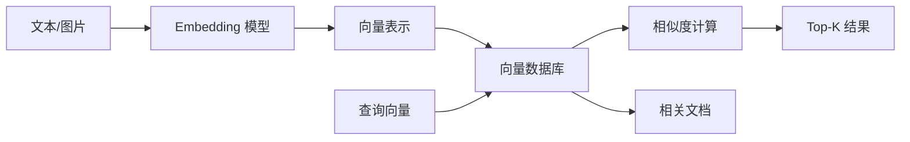
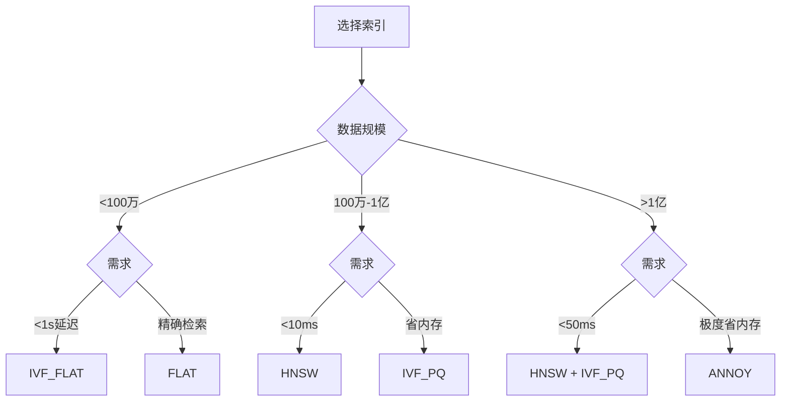

# 第 16 章：向量数据库应用

> 本章介绍向量数据库的核心概念、部署配置和开发实践。重点讲解 Milvus 的使用、Embedding 模型选型，以及相似度检索的优化策略。

## 本章内容提要

| 主题 | 核心技能 |
|------|----------|
| 向量数据库基础 | 概念原理、索引类型、选型对比 |
| Milvus 部署 | Docker 部署、配置优化、高可用 |
| 开发实践 | CRUD 操作、范围查询、过滤检索 |
| 性能优化 | 索引选择、分区策略、查询优化 |

---

## 16.1 向量数据库基础

### 16.1.1 为什么需要向量数据库？

传统关系数据库以行和列存储结构化数据，适合精确查询。但对于以下场景，传统数据库无能为力：

- **语义搜索**：搜索"苹果"时，数据库不知道用户想要水果还是公司
- **相似图片查找**：找出与给定图片相似的其他图片
- **推荐系统**：基于用户兴趣找到相似用户或商品
- **LLM 记忆**：存储和检索文本的语义表示

向量数据库专门为此设计，能够：

1. **存储高维向量**：将文本、图像等转换为向量表示
2. **快速相似度搜索**：在大规模向量中找到最近的邻居
3. **ANN 算法**：近似最近邻搜索，平衡精度和性能

### 16.1.2 核心概念



| 概念 | 说明 |
|------|------|
| **向量 (Vector)** | 数据的数学表示，如 768 维浮点数数组 |
| **Embedding** | 将原始数据转换为向量的过程或结果 |
| **Collection** | 相当于关系数据库的表 |
| **Partition** | Collection 的物理分区，提高查询效率 |
| **Index** | 索引结构，加速相似度搜索 |
| **Top-K** | 返回最相似的 K 条结果 |
| **ANNS** | Approximate Nearest Neighbor Search，近似最近邻 |

### 16.1.3 相似度度量

向量数据库使用多种相似度度量：

```python
from enum import Enum
from typing import List
import numpy as np

class SimilarityMetric(Enum):
    """相似度度量类型"""
    
    # 余弦相似度：-1 到 1，越接近 1 越相似
    COSINE = "COSINE"
    
    # 欧氏距离：0 到 ∞，越接近 0 越相似
    L2 = "L2"
    
    # 内积：-∞ 到 ∞，越大越相似
    IP = "IP"

def cosine_similarity(a: List[float], b: List[float]) -> float:
    """计算余弦相似度"""
    a = np.array(a)
    b = np.array(b)
    
    dot_product = np.dot(a, b)
    norm_a = np.linalg.norm(a)
    norm_b = np.linalg.norm(b)
    
    return dot_product / (norm_a * norm_b)

def euclidean_distance(a: List[float], b: List[float]) -> float:
    """计算欧氏距离"""
    return float(np.linalg.norm(np.array(a) - np.array(b)))

def inner_product(a: List[float], b: List[float]) -> float:
    """计算内积"""
    return float(np.dot(a, b))

# 示例
vec1 = [0.1, 0.8, 0.3]
vec2 = [0.2, 0.7, 0.4]

print(f"余弦相似度: {cosine_similarity(vec1, vec2):.4f}")
print(f"欧氏距离: {euclidean_distance(vec1, vec2):.4f}")
print(f"内积: {inner_product(vec1, vec2):.4f}")
```

**如何选择度量方式：**

| 场景 | 推荐度量 |
|------|----------|
| 文本 Embedding（如 BERT） | COSINE（已归一化） |
| 图像 Embedding（如 ResNet） | COSINE 或 L2 |
| 未归一化的向量 | IP（内积） |
| 需要考虑向量长度 | COSINE |

### 16.1.4 索引类型对比

| 索引类型 | 适用场景 | 精度 | 速度 | 内存 |
|----------|----------|------|------|------|
| **FLAT** | 小规模数据、精确检索 | 100% | 慢 | 高 |
| **IVF_FLAT** | 中等规模、平衡场景 | 高 | 中 | 中 |
| **IVF_PQ** | 大规模、省内存 | 中 | 快 | 低 |
| **HNSW** | 追求速度、高精度 | 高 | 快 | 高 |
| **ANNOY** | 超大规模、树结构 | 中 | 快 | 低 |



---

## 16.2 Milvus 部署与配置

### 16.2.1 Docker 快速部署

```bash
# 创建配置目录
mkdir -p /opt/milvus/volumes
cd /opt/milvus

# 创建 docker-compose.yml
cat > docker-compose.yml << 'EOF'
version: '3.8'

services:
  etcd:
    container_name: milvus-etcd
    image: quay.io/coreos/etcd:v3.5.5
    environment:
      - ETCD_AUTO_COMPACTION_MODE=revision
      - ETCD_AUTO_COMPACTION_RETENTION=1000
      - ETCD_QUOTA_BACKEND_BYTES=4294967296
      - ETCD_SNAPSHOT_COUNT=50000
    volumes:
      - ./volumes/etcd:/etcd
    command: etcd -advertise-client-urls=http://127.0.0.1:2379 -listen-client-urls http://0.0.0.0:2379 --data-dir /etcd
    networks:
      - milvus

  minio:
    container_name: milvus-minio
    image: minio/minio:RELEASE.2023-03-20T20-16-18Z
    environment:
      MINIO_ACCESS_KEY: minioadmin
      MINIO_SECRET_KEY: minioadmin
    volumes:
      - ./volumes/minio:/minio_data
    command: minio server /minio_data
    healthcheck:
      test: ["CMD", "curl", "-f", "http://localhost:9000/minio/health/live"]
      interval: 30s
      timeout: 20s
      retries: 3
    networks:
      - milvus

  milvus:
    container_name: milvus-standalone
    image: milvusdb/milvus:v2.3.3
    command: ["milvus", "run", "standalone"]
    environment:
      ETCD_ENDPOINTS: etcd:2379
      MINIO_ADDRESS: minio:9000
    volumes:
      - ./volumes/milvus:/var/lib/milvus
      - ./configs/milvus.yaml:/milvus/configs/milvus.yaml
    ports:
      - "19530:19530"
      - "9091:9091"
    depends_on:
      - etcd
      - minio
    networks:
      - milvus

networks:
  milvus:
    driver: bridge
EOF

# 创建配置文件
mkdir -p configs
cat > configs/milvus.yaml << 'EOF'
etcd:
  endpoints:
    - etcd:2379
  rootPath: by-dev

storage:
  type: minio
  
minio:
  address: minio:9000
  accessKeyID: minioadmin
  secretAccessKey: minioadmin

log:
  level: info
EOF

# 启动 Milvus
docker-compose up -d

# 检查状态
docker-compose ps
```

### 16.2.2 Milvus Attu 可视化管理

```bash
# 启动 Attu（Milvus 可视化管理工具）
cat >> docker-compose.yml << 'EOF'

  attu:
    container_name: milvus-attu
    image: zilliz/attu:v2.3
    environment:
      MILVUS_ADDRESS: milvus:19530
    ports:
      - "3000:3000"
    networks:
      - milvus
EOF

# 重启
docker-compose up -d attu
```

访问 `http://localhost:3000` 即可使用 Attu 管理 Milvus。

### 16.2.3 生产环境配置

```yaml
# configs/milvus-cluster.yaml (集群模式)
etcd:
  endpoints:
    - etcd-1:2379
    - etcd-2:2379
    - etcd-3:2379
  rootPath: by-dev-production
  metaStoreType: etcd

storage:
  type: minio
  storageClass: "local-path"
  volumes:
    - name: storage
      path: /var/lib/milvus/storage

minio:
  address: minio:9000
  accessKeyID: ${MINIO_ACCESS_KEY}
  secretAccessKey: ${MINIO_SECRET_KEY}
  useSSL: false
  bucketName: milvus-bucket

log:
  level: info
  format: text

dataCoord:
  segment:
    maxSize: 512  # MB
    sealProportion: 0.25
    assignmentExpiration: 2000  # ms

queryCoord:
  autoHandoff: true
  autoBalance: true
  balancer: scoreBasedBalancer
```

---

## 16.3 Milvus Python SDK

### 16.3.1 连接与基础操作

```python
# src/vector_db/milvus_client.py
from pymilvus import (
    connections, Collection, FieldSchema, CollectionSchema,
    DataType, utility, Collection
)
from typing import List, Dict, Any, Optional
import numpy as np

class MilvusClient:
    """Milvus 向量数据库客户端封装"""
    
    def __init__(
        self,
        host: str = "localhost",
        port: str = "19530",
        alias: str = "default"
    ):
        self.alias = alias
        connections.connect(alias=alias, host=host, port=port)
        self.collections = {}
    
    def __enter__(self):
        return self
    
    def __exit__(self, exc_type, exc_val, exc_tb):
        self.close()
    
    def close(self):
        """关闭连接"""
        connections.disconnect(alias=self.alias)
    
    def create_collection(
        self,
        name: str,
        dimension: int,
        description: str = "",
        metric_type: str = "COSINE",
        index_type: str = "IVF_FLAT",
        params: Dict = None
    ) -> Collection:
        """创建 Collection"""
        
        # 如果已存在，先删除
        if utility.has_collection(name):
            utility.drop_collection(name)
        
        # 定义字段
        fields = [
            FieldSchema(name="id", dtype=DataType.VARCHAR, max_length=64, is_primary=True),
            FieldSchema(name="vector", dtype=DataType.FLOAT_VECTOR, dim=dimension),
            FieldSchema(name="text", dtype=DataType.VARCHAR, max_length=512),
            FieldSchema(name="metadata", dtype=DataType.VARCHAR, max_length=2048),
        ]
        
        # 创建 Schema
        schema = CollectionSchema(fields=fields, description=description)
        
        # 创建 Collection
        collection = Collection(name=name, schema=schema)
        
        # 创建索引
        index_params = params or self._get_default_index_params(metric_type, index_type)
        collection.create_index(
            field_name="vector",
            index_params=index_params
        )
        
        # 加载到内存
        collection.load()
        
        self.collections[name] = collection
        return collection
    
    def _get_default_index_params(
        self,
        metric_type: str,
        index_type: str
    ) -> Dict:
        """获取默认索引参数"""
        index_map = {
            "IVF_FLAT": {
                "index_type": "IVF_FLAT",
                "metric_type": metric_type,
                "params": {"nlist": 128}
            },
            "IVF_PQ": {
                "index_type": "IVF_PQ",
                "metric_type": metric_type,
                "params": {"nlist": 128, "m": 16}
            },
            "HNSW": {
                "index_type": "HNSW",
                "metric_type": metric_type,
                "params": {"M": 16, "efConstruction": 200}
            },
            "FLAT": {
                "index_type": "FLAT",
                "metric_type": metric_type,
                "params": {}
            }
        }
        return index_map.get(index_type, index_map["IVF_FLAT"])
    
    def get_collection(self, name: str) -> Collection:
        """获取 Collection"""
        if name not in self.collections:
            if not utility.has_collection(name):
                raise ValueError(f"Collection '{name}' 不存在")
            collection = Collection(name=name)
            collection.load()
            self.collections[name] = collection
        return self.collections[name]
    
    def insert(
        self,
        collection_name: str,
        ids: List[str],
        vectors: List[List[float]],
        texts: List[str],
        metadata: List[Dict] = None
    ) -> Dict:
        """插入向量"""
        collection = self.get_collection(collection_name)
        
        # 准备数据
        data = [
            ids,
            vectors,
            texts,
            [str(m) if m else "{}" for m in (metadata or [{}] * len(ids))]
        ]
        
        # 插入
        result = collection.insert(data)
        
        # 刷新
        collection.flush()
        
        return {
            "insert_count": result.insert_count,
            "primary_keys": result.primary_keys
        }
    
    def search(
        self,
        collection_name: str,
        query_vectors: List[List[float]],
        top_k: int = 10,
        expr: str = None,
        output_fields: List[str] = None,
        search_params: Dict = None
    ) -> List[List[Dict]]:
        """向量搜索"""
        collection = self.get_collection(collection_name)
        
        if output_fields is None:
            output_fields = ["id", "text", "metadata"]
        
        if search_params is None:
            search_params = {"metric_type": "COSINE", "params": {"nprobe": 10}}
        
        results = collection.search(
            data=query_vectors,
            anns_field="vector",
            param=search_params,
            limit=top_k,
            expr=expr,
            output_fields=output_fields
        )
        
        # 格式化结果
        formatted_results = []
        for hits in results:
            hit_list = []
            for hit in hits:
                hit_list.append({
                    "id": hit.entity.get("id"),
                    "text": hit.entity.get("text"),
                    "metadata": hit.entity.get("metadata"),
                    "distance": hit.distance
                })
            formatted_results.append(hit_list)
        
        return formatted_results
    
    def delete_by_id(self, collection_name: str, ids: List[str]) -> int:
        """根据 ID 删除"""
        collection = self.get_collection(collection_name)
        
        expr = f'id in [{",".join(f"\"{i}\"" for i in ids)}]'
        result = collection.delete(expr)
        
        collection.flush()
        return result.delete_count
    
    def query(
        self,
        collection_name: str,
        expr: str,
        output_fields: List[str] = None
    ) -> List[Dict]:
        """标量查询"""
        collection = self.get_collection(collection_name)
        
        if output_fields is None:
            output_fields = ["id", "text", "metadata"]
        
        results = collection.query(expr=expr, output_fields=output_fields)
        return results
    
    def get_collection_stats(self, collection_name: str) -> Dict:
        """获取 Collection 统计信息"""
        collection = self.get_collection(collection_name)
        
        return {
            "name": collection_name,
            "row_count": collection.num_entities,
            "partitions": collection.partitions,
            "description": collection.description
        }
```

### 16.3.2 高级查询功能

```python
# src/vector_db/advanced_queries.py
from typing import List, Dict, Optional
import numpy as np

class AdvancedSearch:
    """高级搜索功能"""
    
    def __init__(self, milvus_client):
        self.client = milvus_client
    
    def search_with_filter(
        self,
        collection_name: str,
        query_vector: List[float],
        filter_expr: str,
        top_k: int = 10
    ) -> List[Dict]:
        """带过滤条件的搜索"""
        return self.client.search(
            collection_name=collection_name,
            query_vectors=[query_vector],
            top_k=top_k,
            expr=filter_expr
        )[0]
    
    def search_by_text(
        self,
        collection_name: str,
        text: str,
        embedding_model,
        top_k: int = 10,
        filter_expr: str = None
    ) -> List[Dict]:
        """文本搜索（自动转向量）"""
        # 生成 embedding
        query_vector = embedding_model.encode(text)
        
        return self.client.search(
            collection_name=collection_name,
            query_vectors=[query_vector],
            top_k=top_k,
            expr=filter_expr
        )[0]
    
    def batch_search(
        self,
        collection_name: str,
        query_vectors: List[List[float]],
        top_k: int = 10
    ) -> List[List[Dict]]:
        """批量搜索"""
        return self.client.search(
            collection_name=collection_name,
            query_vectors=query_vectors,
            top_k=top_k
        )
    
    def range_search(
        self,
        collection_name: str,
        query_vector: List[float],
        radius: float,
        top_k: int = 100
    ) -> List[Dict]:
        """范围搜索（距离在 radius 内的所有向量）"""
        collection = self.client.get_collection(collection_name)
        
        search_params = {
            "metric_type": "COSINE",
            "params": {"radius": radius, "range_filter": 1.0}
        }
        
        results = collection.search(
            data=[query_vector],
            anns_field="vector",
            param=search_params,
            limit=top_k,
            output_fields=["id", "text", "metadata", "distance"]
        )
        
        return [{
            "id": hit.entity.get("id"),
            "text": hit.entity.get("text"),
            "distance": hit.distance
        } for hit in results[0]]
    
    def get_recommendations(
        self,
        collection_name: str,
        user_id: str,
        embedding_model,
        exclude_items: List[str] = None,
        top_k: int = 10
    ) -> List[Dict]:
        """基于用户历史的推荐"""
        # 获取用户偏好向量
        user_vector = self._get_user_preference_vector(collection_name, user_id)
        
        if not user_vector:
            return []
        
        # 构建过滤表达式（排除用户已交互的）
        filter_expr = None
        if exclude_items:
            item_ids = ",".join(f'"{i}"' for i in exclude_items)
            filter_expr = f'id not in [{item_ids}]'
        
        return self.client.search(
            collection_name=collection_name,
            query_vectors=[user_vector],
            top_k=top_k,
            expr=filter_expr
        )[0]
    
    def _get_user_preference_vector(
        self,
        collection_name: str,
        user_id: str
    ) -> Optional[List[float]]:
        """获取用户偏好向量"""
        results = self.client.query(
            collection_name=collection_name,
            expr=f'id == "{user_id}_preference"'
        )
        
        if results and len(results) > 0:
            return results[0].get("vector")
        return None
```

---

## 16.4 Embedding 模型选型

### 16.4.1 常用 Embedding 模型

| 模型 | 维度 | 适用场景 | 来源 |
|------|------|----------|------|
| **text-embedding-ada-002** | 1536 | 通用、英文为主 | OpenAI |
| **text-embedding-3-small/large** | 256-3072 | 通用、多语言 | OpenAI |
| **m3e-base** | 768 | 中文、英文 | MokaAI |
| **text2vec-base-chinese** | 768 | 中文 | shibing624 |
| **bge-base-zh** | 768 | 中文、英文 | BAAI |
| **bge-large-zh** | 1024 | 高精度中文 | BAAI |
| **gte-base-zh** | 768 | 多语言 | Alibaba-NLP |

### 16.4.2 阿里云 DashScope Embedding

```python
# src/embedding/dashscope_embedding.py
from dashscope import TextEmbedding
from typing import List, Dict
import numpy as np

class DashScopeEmbedding:
    """DashScope Embedding 模型封装"""
    
    def __init__(
        self,
        model: str = "text-embedding-v2",
        api_key: str = None
    ):
        self.model = model
        self.client = TextEmbedding(api_key=api_key)
        
        # 模型维度映射
        self.dimension_map = {
            "text-embedding-v1": 1536,
            "text-embedding-v2": 1536,
            "text-embedding-v3": 1536,
            "text-embedding-async-v2": 1536,
            "text-embedding-async-v3": 1536
        }
    
    @property
    def dimension(self) -> int:
        """获取模型维度"""
        return self.dimension_map.get(self.model, 1536)
    
    def encode(self, texts: str | List[str]) -> List[float] | List[List[float]]:
        """编码文本为向量"""
        if isinstance(texts, str):
            texts = [texts]
        
        response = self.client.async_call(texts)
        
        if response.status_code != 200:
            raise ValueError(f"Embedding 请求失败: {response.message}")
        
        embeddings = []
        for item in response.output['embeddings']:
            embeddings.append(item['embedding'])
        
        return embeddings if len(embeddings) > 1 else embeddings[0]
    
    def encode_batch(
        self,
        texts: List[str],
        batch_size: int = 25,
        max_retries: int = 3
    ) -> List[List[float]]:
        """批量编码（处理大量文本）"""
        all_embeddings = []
        
        for i in range(0, len(texts), batch_size):
            batch = texts[i:i + batch_size]
            
            for attempt in range(max_retries):
                try:
                    response = self.client.async_call(batch)
                    if response.status_code == 200:
                        for item in response.output['embeddings']:
                            all_embeddings.append(item['embedding'])
                        break
                except Exception as e:
                    if attempt == max_retries - 1:
                        raise
                    continue
        
        return all_embeddings
    
    def compute_similarity(
        self,
        text1: str,
        text2: str
    ) -> float:
        """计算两个文本的相似度"""
        emb1, emb2 = self.encode([text1, text2])
        
        # 余弦相似度
        dot = sum(a * b for a, b in zip(emb1, emb2))
        norm1 = sum(a * a for a in emb1) ** 0.5
        norm2 = sum(b * b for b in emb2) ** 0.5
        
        return dot / (norm1 * norm2)


# 使用示例
if __name__ == "__main__":
    embedding = DashScopeEmbedding(model="text-embedding-v2")
    
    # 单文本编码
    vec = embedding.encode("你好，世界")
    print(f"向量维度: {len(vec)}")
    
    # 批量编码
    texts = ["今天天气真好", "明天会下雨吗", "我喜欢机器学习"]
    vectors = embedding.encode_batch(texts)
    print(f"批量编码结果: {len(vectors)} 个向量")
    
    # 相似度计算
    sim = embedding.compute_similarity("苹果", "水果")
    print(f"相似度: {sim:.4f}")
```

### 16.4.3 本地 Embedding 模型

```python
# src/embedding/local_embedding.py
from sentence_transformers import SentenceTransformer
from typing import List
import numpy as np

class LocalEmbedding:
    """本地 Embedding 模型"""
    
    def __init__(
        self,
        model_name: str = "BAAI/bge-base-zh-v1.5",
        device: str = "cuda"  # 或 "cpu"
    ):
        self.model = SentenceTransformer(model_name, device=device)
        self.dimension = self.model.get_sentence_embedding_dimension()
    
    def encode(
        self,
        texts: str | List[str],
        normalize: bool = True,
        batch_size: int = 32
    ) -> List[List[float]]:
        """编码文本"""
        if isinstance(texts, str):
            texts = [texts]
        
        embeddings = self.model.encode(
            texts,
            normalize_embeddings=normalize,
            batch_size=batch_size,
            show_progress_bar=False
        )
        
        return embeddings.tolist()
    
    def encode_query(self, query: str) -> List[float]:
        """编码查询（添加查询指令）"""
        prefixed = f"为这个句子生成表示以用于检索相关文章: {query}"
        return self.encode(prefixed)[0]
    
    def compute_similarity(
        self,
        text1: str,
        text2: str
    ) -> float:
        """计算余弦相似度"""
        emb1, emb2 = self.encode([text1, text2])
        return float(np.dot(emb1, emb2))


# 使用示例
if __name__ == "__main__":
    # 使用 BAAI BGE 中文模型
    embedding = LocalEmbedding("BAAI/bge-base-zh-v1.5")
    
    # 编码
    vec = embedding.encode("自然语言处理是人工智能的一个重要分支")
    print(f"向量维度: {len(vec)}")
    
    # 相似度
    sim = embedding.compute_similarity("机器学习", "深度学习")
    print(f"相似度: {sim:.4f}")
```

---

## 16.5 完整应用示例

### 16.5.1 文档向量数据库构建

```python
# examples/build_vector_db.py
from src.vector_db.milvus_client import MilvusClient
from src.embedding.dashscope_embedding import DashScopeEmbedding
from typing import List, Dict
import json
from pathlib import Path

class DocumentVectorStore:
    """文档向量存储系统"""
    
    def __init__(
        self,
        collection_name: str = "documents",
        embedding_model: str = "text-embedding-v2"
    ):
        self.milvus = MilvusClient()
        self.embedding = DashScopeEmbedding(model=embedding_model)
        self.collection_name = collection_name
        
        # 初始化 Collection
        self._ensure_collection()
    
    def _ensure_collection(self):
        """确保 Collection 存在"""
        try:
            self.milvus.get_collection(self.collection_name)
        except ValueError:
            self.milvus.create_collection(
                name=self.collection_name,
                dimension=self.embedding.dimension,
                description="文档向量集合",
                metric_type="COSINE",
                index_type="HNSW"
            )
    
    def add_documents(
        self,
        documents: List[Dict],
        batch_size: int = 100
    ):
        """批量添加文档"""
        for i in range(0, len(documents), batch_size):
            batch = documents[i:i + batch_size]
            
            # 提取文本
            texts = [doc.get("text", doc.get("content", "")) for doc in batch]
            
            # 生成向量
            vectors = self.embedding.encode_batch(texts)
            
            # 准备数据
            ids = [f"doc_{i+j}" for j in range(len(batch))]
            metadatas = [
                json.dumps({
                    "source": doc.get("source", ""),
                    "title": doc.get("title", ""),
                    "category": doc.get("category", "")
                }, ensure_ascii=False)
                for doc in batch
            ]
            
            # 插入
            self.milvus.insert(
                collection_name=self.collection_name,
                ids=ids,
                vectors=vectors,
                texts=texts,
                metadata=metadatas
            )
            
            print(f"已插入 {len(batch)} 条文档")
    
    def search(
        self,
        query: str,
        top_k: int = 5,
        category: str = None
    ) -> List[Dict]:
        """搜索文档"""
        # 生成查询向量
        query_vector = self.embedding.encode(query)
        
        # 构建过滤条件
        filter_expr = None
        if category:
            filter_expr = f'metadata contains "{category}"'
        
        # 搜索
        results = self.milvus.search(
            collection_name=self.collection_name,
            query_vectors=[query_vector],
            top_k=top_k,
            expr=filter_expr
        )[0]
        
        # 解析元数据
        for result in results:
            try:
                result["metadata"] = json.loads(result["metadata"])
            except:
                pass
        
        return results
    
    def delete_document(self, doc_id: str):
        """删除文档"""
        self.milvus.delete_by_id(self.collection_name, [doc_id])


# 使用示例
if __name__ == "__main__":
    # 初始化
    store = DocumentVectorStore("my_documents")
    
    # 添加文档
    documents = [
        {
            "text": "阿里云函数计算是一项基于 Serverless 架构的计算服务",
            "title": "函数计算介绍",
            "category": "产品"
        },
        {
            "text": "RAG是一种检索增强生成技术，结合检索和生成",
            "title": "RAG技术原理",
            "category": "技术"
        }
    ]
    store.add_documents(documents)
    
    # 搜索
    results = store.search("阿里云服务", top_k=3)
    for r in results:
        print(f"[{r['distance']:.4f}] {r['text']}")
```

### 16.5.2 性能监控与优化

```python
# src/vector_db/performance_monitor.py
from pymilvus import connections, Collection
from typing import Dict, List
import time
from contextlib import contextmanager

class PerformanceMonitor:
    """性能监控器"""
    
    def __init__(self, milvus_client):
        self.client = milvus_client
        self.metrics = []
    
    @contextmanager
    def measure(self, operation: str):
        """测量操作耗时"""
        start = time.time()
        error = None
        
        try:
            yield
        except Exception as e:
            error = str(e)
            raise
        finally:
            elapsed = time.time() - start
            self.metrics.append({
                "operation": operation,
                "elapsed_ms": elapsed * 1000,
                "error": error,
                "timestamp": time.time()
            })
    
    def get_stats(self) -> Dict:
        """获取统计信息"""
        if not self.metrics:
            return {}
        
        import statistics
        
        op_metrics = {}
        for m in self.metrics:
            op = m["operation"]
            if op not in op_metrics:
                op_metrics[op] = []
            op_metrics[op].append(m["elapsed_ms"])
        
        stats = {}
        for op, times in op_metrics.items():
            stats[op] = {
                "count": len(times),
                "avg_ms": statistics.mean(times),
                "min_ms": min(times),
                "max_ms": max(times),
                "p95_ms": sorted(times)[int(len(times) * 0.95)] if len(times) > 20 else max(times)
            }
        
        return stats
    
    def print_stats(self):
        """打印统计信息"""
        stats = self.get_stats()
        
        print("\n=== Milvus 性能统计 ===")
        print(f"{'操作':<15} {'次数':<8} {'平均(ms)':<12} {'P95(ms)':<12} {'最大(ms)':<12}")
        print("-" * 60)
        
        for op, stat in stats.items():
            print(f"{op:<15} {stat['count']:<8} {stat['avg_ms']:<12.2f} "
                  f"{stat['p95_ms']:<12.2f} {stat['max_ms']:<12.2f}")


# 优化建议
OPTIMIZATION_TIPS = """
=== Milvus 性能优化建议 ===

1. 索引选择
   - 数据量 < 100万: IVF_FLAT
   - 数据量 100万-1亿: HNSW
   - 需要压缩内存: IVF_PQ

2. 分区策略
   - 按时间分区: 定期查询适合
   - 按类别分区: 过滤查询适合

3. 查询参数
   - nprobe (IVF): 增加提高精度，降低速度
   - ef (HNSW): 增加提高精度，降低速度

4. 内存配置
   - 确保 Milvus 有足够内存加载 Collection
   - 使用 minio 或 S3 存储历史数据

5. 批量操作
   - 插入: 批量 500-1000 条最优
   - 查询: 并行查询多个向量
"""

def print_optimization_tips():
    print(OPTIMIZATION_TIPS)
```

---

## 16.6 本章小结

本章介绍了向量数据库的核心内容：

| 主题 | 核心要点 |
|------|----------|
| **向量基础** | 相似度度量、索引类型、选型对比 |
| **Milvus 部署** | Docker 部署、Attu 可视化、生产配置 |
| **Python SDK** | CRUD 操作、过滤查询、批量处理 |
| **Embedding** | DashScope 模型、本地模型、选型建议 |
| **性能优化** | 索引选择、分区策略、监控调优 |

### 选型建议

| 场景 | 推荐方案 |
|------|----------|
| 小规模实验 | Milvus Lite / Zilliz Cloud 免费版 |
| 生产环境 | Milvus + K8s / Zilliz Cloud 企业版 |
| 超大规模 | Milvus Cluster / Pinecone |
| 完全托管 | Zilliz Cloud / Azure AI Search |

---

## 延伸阅读

- [Milvus 官方文档](https://milvus.io/docs)
- [Embedding 模型对比 (MTEB)](https://huggingface.co/spaces/mteb/leaderboard)
- [向量数据库对比](https://github.com/zilliztech/awesome-vector-db)
- [BAAI BGE 模型](https://huggingface.co/BAAI/bge-base-zh-v1.5)
