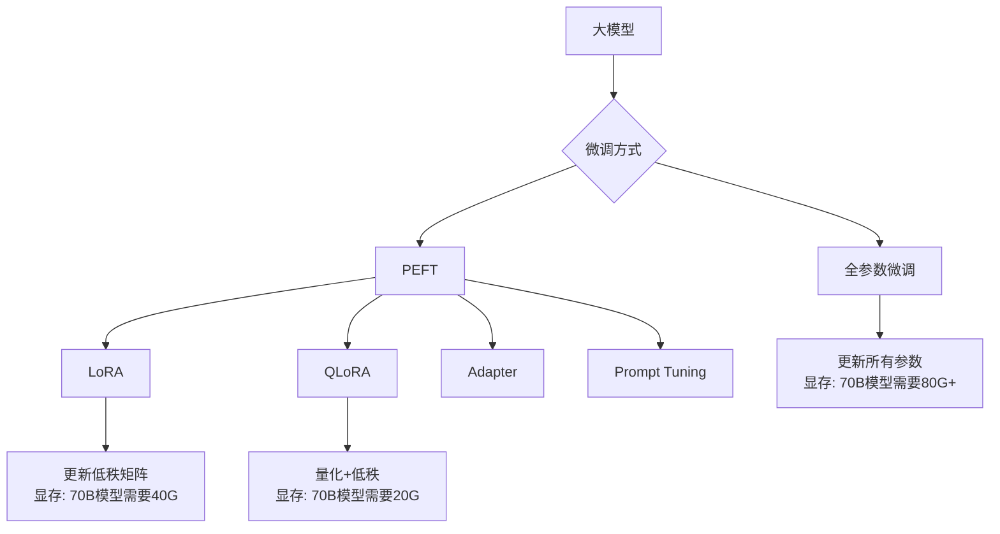

# 第 17 章：阿里云 PAI 模型微调

> 本章介绍模型微调的基础理论，并通过阿里云 PAI 平台进行 LoRA 微调实战。让读者掌握定制化大模型的技能。

## 本章内容提要

| 主题 | 核心技能 |
|------|----------|
| 微调基础 | 全参数微调 vs PEFT、LoRA/QLoRA 原理 |
| PAI 平台 | DSW/EASC 环境、算力配置 |
| LoRA 实战 | 数据准备、训练配置、模型导出 |
| 模型评估 | 评测指标、效果对比 |

---

## 17.1 模型微调基础

### 17.1.1 为什么要微调？

预训练大模型虽然在通用任务上表现出色，但在特定领域可能效果不佳：

| 场景 | 预训练模型 | 微调后模型 |
|------|------------|------------|
| 医疗问答 | 泛泛而谈 | 准确引用医学指南 |
| 代码生成 | 通用代码 | 符合公司规范 |
| 对话风格 | 机械生硬 | 符合品牌调性 |

### 17.1.2 全参数微调 vs PEFT

**全参数微调 (Full Fine-tuning)**
- 更新所有参数
- 优点：效果最好
- 缺点：显存大、耗时长、容易过拟合

**PEFT (Parameter-Efficient Fine-Tuning)**
- 只更新少量参数
- 主要方法：
  - **LoRA**: 低秩适配
  - **QLoRA**: 量化 + LoRA
  - **Adapter**: 插入适配层
  - **Prompt Tuning**: 软提示



### 17.1.3 LoRA 原理详解

LoRA (Low-Rank Adaptation) 的核心思想：

```
原始权重: W (d × d)
LoRA更新: ΔW = BA (r × d, 其中 r << d)

最终权重: W' = W + α · BA
```

- W: 预训练权重（冻结）
- A, B: 可学习的低秩矩阵
- α: 缩放因子

```python
# LoRA 原理示意
import torch
import torch.nn as nn

class LoRALinear(nn.Module):
    """LoRA 线性层"""
    
    def __init__(
        self,
        in_features: int,
        out_features: int,
        rank: int = 4,  # 低秩维度
        alpha: float = 1.0
    ):
        super().__init__()
        self.rank = rank
        self.alpha = alpha
        
        # 原始权重（冻结）
        self.weight = nn.Parameter(
            torch.randn(out_features, in_features),
            requires_grad=False
        )
        
        # LoRA 低秩矩阵（可学习）
        self.lora_A = nn.Parameter(torch.randn(rank, in_features))
        self.lora_B = nn.Parameter(torch.zeros(out_features, rank))
        
        # 初始化
        nn.init.normal_(self.lora_A, std=1.0 / rank)
    
    def forward(self, x: torch.Tensor) -> torch.Tensor:
        # 原始输出
        base_output = torch.nn.functional.linear(x, self.weight)
        
        # LoRA 输出
        lora_output = torch.nn.functional.linear(
            x @ self.lora_A.T,
            self.lora_B
        )
        
        # 合并
        return base_output + self.alpha * lora_output
```

### 17.1.4 QLoRA 原理

QLoRA 在 LoRA 基础上增加了量化：

1. **4-bit NormalFloat (NF4)** 量化预训练权重
2. **LoRA** 更新低秩矩阵
3. **双重量化**：量化量化常数

```python
# QLoRA 关键配置
q_lora_config = {
    "quantization": {
        "load_in_4bit": True,
        "bnb_4bit_compute_dtype": "bfloat16",
        "bnb_4bit_use_double_quant": True,
        "bnb_4bit_quant_type": "nf4"
    },
    "lora": {
        "r": 64,
        "lora_alpha": 16,
        "target_modules": ["q_proj", "v_proj", "k_proj", "o_proj"],
        "lora_dropout": 0.05
    }
}
```

---

## 17.2 阿里云 PAI 平台

### 17.2.1 PAI 产品体系

| 产品 | 说明 | 适用场景 |
|------|------|----------|
| **PAI-DSW** | 交互式建模 | 调试实验 |
| **PAI-EASC** | 弹性加速计算 | 大规模训练 |
| **PAI-DLC** | 深度学习容器 | 生产训练 |
| **PAI-Blade** | 模型推理优化 | 部署加速 |
| **PAI-ModelHub** | 模型市场 | 模型分享 |

### 17.2.2 PAI-DSW 环境配置

```bash
# 1. 安装依赖包
pip install transformers datasets peft accelerate bitsandbytes
pip install aliyun-pai-mcp  # 阿里云 PAI SDK

# 2. 配置访问凭证
# 在 PAI 控制台创建访问凭证
export PAI_ACCESS_KEY_ID="your_access_key_id"
export PAI_ACCESS_KEY_SECRET="your_access_key_secret"
export PAI_REGION="cn-hangzhou"

# 3. 连接 PAI 工作空间
python -c "
from pai.model import Model
from pai.session import Session

session = Session(
    region='cn-hangzhou',
    workspace_id='your_workspace_id'
)
print('PAI 连接成功')
"
```

### 17.2.3 计算资源配置

```python
# 训练配置
training_config = {
    # 实例类型
    "instance_type": "ecs.gn7e-c16g1.4xlarge",  # A100 80G
    
    # GPU 数量
    "gpu_count": 1,
    
    # 存储
    "nas_storage": {
        "mount_point": "/mnt/workspace",
        "capacity": 200  # GB
    },
    
    # 镜像
    "image": "pai/algorithm:pytorch-2.1.0-cuda11.8-gpu",
    
    # 超时
    "max_running_time": 3600 * 8  # 8小时
}
```

---

## 17.3 LoRA 微调实战

### 17.3.1 数据准备

```python
# src/fine_tuning/data_prepare.py
from datasets import Dataset
import json
from typing import List, Dict

class TrainingDataPreparer:
    """训练数据准备器"""
    
    @staticmethod
    def prepare_sft_data(
        conversations: List[Dict],
        template: str = "qwen"
    ) -> Dataset:
        """准备 SFT (Supervised Fine-Tuning) 数据
        
        格式:
        [
            {
                "messages": [
                    {"role": "user", "content": "问题"},
                    {"role": "assistant", "content": "回答"}
                ]
            }
        ]
        """
        formatted_data = []
        
        for conv in conversations:
            messages = conv["messages"]
            
            # 应用模板格式化
            text = TrainingDataPreparer._apply_template(messages, template)
            
            formatted_data.append({
                "text": text,
                "category": conv.get("category", "general")
            })
        
        return Dataset.from_list(formatted_data)
    
    @staticmethod
    def _apply_template(messages: List[Dict], template: str) -> str:
        """应用对话模板"""
        
        if template == "qwen":
            # Qwen 模板
            text = "<|im_start|>system\n你是一个有帮助的助手。<|im_end|>\n"
            for msg in messages:
                role = msg["role"]
                content = msg["content"]
                text += f"<|im_start|>{role}\n{content}<|im_end|>\n"
            text += "<|im_start|>assistant\n"
            
        elif template == "llama":
            # Llama 模板
            text = "[INST] "
            for i, msg in enumerate(messages):
                if msg["role"] == "user":
                    text += f"{msg['content']} [/INST] "
                else:
                    text += f"{msg['content']} </s><s>[INST] "
            text = text.rstrip(" [/INST] ")
            
        else:
            # 通用模板
            for msg in messages:
                text += f"{msg['role'].upper()}: {msg['content']}\n"
        
        return text
    
    @staticmethod
    def load_jsonl(file_path: str) -> List[Dict]:
        """加载 JSONL 格式数据"""
        data = []
        with open(file_path, 'r', encoding='utf-8') as f:
            for line in f:
                if line.strip():
                    data.append(json.loads(line))
        return data
    
    @staticmethod
    def split_train_eval(
        dataset: Dataset,
        train_ratio: float = 0.9
    ) -> tuple:
        """拆分训练集和验证集"""
        return dataset.train_test_split(test_size=1-train_ratio, seed=42)


# 数据格式示例
sample_data = [
    {
        "messages": [
            {"role": "user", "content": "什么是函数计算？"},
            {"role": "assistant", "content": "阿里云函数计算（FC）是一项基于事件驱动的全托管计算服务。您无需管理服务器等基础设施，只需编写代码并上传，函数计算会为您准备好计算资源。"}
        ]
    },
    {
        "messages": [
            {"role": "user", "content": "如何优化 RAG 系统？"},
            {"role": "assistant", "content": "优化 RAG 系统可以从以下几个方面入手：\n1. 知识库构建：优化文档分块策略\n2. 检索优化：使用混合检索和重排序\n3. 生成增强：上下文压缩和溯源标注"}
        ]
    }
]
```

### 17.3.2 训练配置与脚本

```python
# src/fine_tuning/lora_trainer.py
from transformers import (
    AutoModelForCausalLM,
    AutoTokenizer,
    TrainingArguments,
    Trainer,
    DataCollatorForLanguageModeling
)
from peft import (
    LoraConfig,
    get_peft_model,
    TaskType
)
from datasets import Dataset
import torch

class LoRATrainer:
    """LoRA 微调训练器"""
    
    def __init__(
        self,
        model_name: str,
        output_dir: str = "./output"
    ):
        self.model_name = model_name
        self.output_dir = output_dir
        self.tokenizer = None
        self.model = None
    
    def setup_model(self, use_quantization: bool = True):
        """加载模型和分词器"""
        
        # 加载分词器
        self.tokenizer = AutoTokenizer.from_pretrained(
            self.model_name,
            trust_remote_code=True,
            padding_side="right"
        )
        
        # 特殊 token 处理
        if self.tokenizer.pad_token is None:
            self.tokenizer.pad_token = self.tokenizer.eos_token
        
        # 加载模型
        load_kwargs = {
            "trust_remote_code": True,
            "torch_dtype": torch.bfloat16,
            "device_map": "auto"
        }
        
        if use_quantization:
            # QLoRA 配置
            from transformers import BitsAndBytesConfig
            
            bnb_config = BitsAndBytesConfig(
                load_in_4bit=True,
                bnb_4bit_compute_dtype=torch.bfloat16,
                bnb_4bit_use_double_quant=True,
                bnb_4bit_quant_type="nf4"
            )
            load_kwargs["quantization_config"] = bnb_config
        
        self.model = AutoModelForCausalLM.from_pretrained(
            self.model_name,
            **load_kwargs
        )
        
        # 梯度检查点
        self.model.gradient_checkpointing_enable()
        
        print(f"模型加载完成: {self.model.num_parameters() / 1e9:.2f}B 参数")
    
    def setup_lora(self, lora_config: dict):
        """配置 LoRA"""
        
        peft_config = LoraConfig(
            task_type=TaskType.CAUSAL_LM,
            r=lora_config.get("r", 16),
            lora_alpha=lora_config.get("alpha", 32),
            lora_dropout=lora_config.get("dropout", 0.05),
            target_modules=lora_config.get(
                "target_modules",
                ["q_proj", "v_proj", "k_proj", "o_proj", "gate_proj", "up_proj", "down_proj"]
            ),
            bias="none",
            inference_mode=False
        )
        
        self.model = get_peft_model(self.model, peft_config)
        
        # 打印可训练参数
        trainable_params, all_params = self._count_params()
        print(f"可训练参数: {trainable_params / 1e6:.2f}M / {all_params / 1e9:.2f}B "
              f"({trainable_params / all_params * 100:.2f}%)")
    
    def _count_params(self):
        """统计参数数量"""
        trainable_params = sum(p.numel() for p in self.model.parameters() if p.requires_grad)
        all_params = sum(p.numel() for p in self.model.parameters())
        return trainable_params, all_params
    
    def tokenize_dataset(self, dataset: Dataset, max_length: int = 2048) -> Dataset:
        """Tokenize 数据集"""
        
        def tokenize_function(examples):
            # 使用 tokenizer
            result = self.tokenizer(
                examples["text"],
                truncation=True,
                max_length=max_length,
                padding="max_length",
                return_tensors=None
            )
            
            # 标签与输入相同
            result["labels"] = result["input_ids"].copy()
            
            return result
        
        return dataset.map(
            tokenize_function,
            batched=True,
            remove_columns=dataset.column_names
        )
    
    def train(
        self,
        train_dataset: Dataset,
        eval_dataset: Dataset = None,
        training_args: dict = None
    ):
        """开始训练"""
        
        if training_args is None:
            training_args = {
                "output_dir": self.output_dir,
                "num_train_epochs": 3,
                "per_device_train_batch_size": 4,
                "gradient_accumulation_steps": 4,
                "learning_rate": 2e-4,
                "warmup_ratio": 0.03,
                "lr_scheduler_type": "cosine",
                "logging_steps": 10,
                "save_steps": 100,
                "eval_steps": 100,
                "save_total_limit": 3,
                "bf16": True,
                "tf32": True,
                "remove_unused_columns": False
            }
        
        training_arguments = TrainingArguments(
            **training_args
        )
        
        # 数据整理器
        data_collator = DataCollatorForLanguageModeling(
            tokenizer=self.tokenizer,
            mlm=False  # Causal LM 不使用 MLM
        )
        
        # Trainer
        trainer = Trainer(
            model=self.model,
            args=training_arguments,
            train_dataset=train_dataset,
            eval_dataset=eval_dataset,
            data_collator=data_collator
        )
        
        trainer.train()
        
        return trainer
    
    def save_model(self, path: str = None):
        """保存模型"""
        save_path = path or self.output_dir
        self.model.save_pretrained(save_path)
        self.tokenizer.save_pretrained(save_path)
        print(f"模型已保存到: {save_path}")
```

### 17.3.3 完整训练脚本

```python
# scripts/train_lora.py
"""
LoRA 微调训练脚本
用法: python scripts/train_lora.py --model_name Qwen/Qwen2-7B --data_path data/train.jsonl
"""

import argparse
import json
from pathlib import Path
from src.fine_tuning.lora_trainer import LoRATrainer
from src.fine_tuning.data_prepare import TrainingDataPreparer

def parse_args():
    parser = argparse.ArgumentParser(description="LoRA 微调训练")
    parser.add_argument("--model_name", type=str, default="Qwen/Qwen2-7B")
    parser.add_argument("--data_path", type=str, required=True)
    parser.add_argument("--output_dir", type=str, default="./output/lora_model")
    parser.add_argument("--max_length", type=int, default=2048)
    parser.add_argument("--num_epochs", type=int, default=3)
    parser.add_argument("--batch_size", type=int, default=4)
    parser.add_argument("--use_quantization", action="store_true")
    parser.add_argument("--lora_r", type=int, default=16)
    parser.add_argument("--lora_alpha", type=int, default=32)
    return parser.parse_args()

def main():
    args = parse_args()
    
    print("=" * 50)
    print("LoRA 微调训练")
    print("=" * 50)
    print(f"模型: {args.model_name}")
    print(f"数据: {args.data_path}")
    print(f"输出: {args.output_dir}")
    print("=" * 50)
    
    # 1. 准备数据
    print("\n[1/5] 准备训练数据...")
    raw_data = TrainingDataPreparer.load_jsonl(args.data_path)
    dataset = TrainingDataPreparer.prepare_sft_data(raw_data)
    train_ds, eval_ds = TrainingDataPreparer.split_train_eval(dataset)
    print(f"训练集: {len(train_ds)} 条, 验证集: {len(eval_ds)} 条")
    
    # 2. 初始化训练器
    print("\n[2/5] 初始化训练器...")
    trainer = LoRATrainer(
        model_name=args.model_name,
        output_dir=args.output_dir
    )
    
    # 3. 加载模型
    print("\n[3/5] 加载模型...")
    trainer.setup_model(use_quantization=args.use_quantization)
    
    # 4. 配置 LoRA
    print("\n[4/5] 配置 LoRA...")
    trainer.setup_lora({
        "r": args.lora_r,
        "alpha": args.lora_alpha
    })
    
    # 5. Tokenize
    print("\n[5/5] Tokenize 数据...")
    train_tokenized = trainer.tokenize_dataset(train_ds, args.max_length)
    eval_tokenized = trainer.tokenize_dataset(eval_ds, args.max_length)
    
    # 开始训练
    print("\n开始训练...")
    training_args = {
        "output_dir": args.output_dir,
        "num_train_epochs": args.num_epochs,
        "per_device_train_batch_size": args.batch_size,
        "gradient_accumulation_steps": 4,
        "learning_rate": 2e-4,
        "warmup_ratio": 0.03,
        "logging_steps": 10,
        "save_steps": 100,
        "eval_steps": 100,
        "bf16": True,
        "save_total_limit": 2
    }
    
    trainer.train(train_tokenized, eval_tokenized, training_args)
    
    # 保存模型
    trainer.save_model()

if __name__ == "__main__":
    main()
```

### 17.3.4 使用示例

```bash
# 在 PAI-DSW 中运行
python scripts/train_lora.py \
    --model_name Qwen/Qwen2-7B \
    --data_path /mnt/workspace/data/train.jsonl \
    --output_dir /mnt/workspace/output/campus_assistant \
    --num_epochs 3 \
    --batch_size 4 \
    --use_quantization \
    --lora_r 16 \
    --lora_alpha 32
```

---

## 17.4 模型合并与导出

### 17.4.1 LoRA 权重合并

```python
# src/fine_tuning/model_merger.py
from peft import PeftModel
from transformers import AutoModelForCausalLM, AutoTokenizer
import torch

class ModelMerger:
    """模型合并器"""
    
    @staticmethod
    def merge_lora_weights(
        base_model_path: str,
        lora_model_path: str,
        output_path: str,
        save_tokenizer: bool = True
    ):
        """合并 LoRA 权重到基座模型
        
        合并后的模型可以直接加载使用，无需 PEFT
        """
        print(f"加载基座模型: {base_model_path}")
        
        # 加载基座模型
        base_model = AutoModelForCausalLM.from_pretrained(
            base_model_path,
            torch_dtype=torch.bfloat16,
            device_map="auto",
            trust_remote_code=True
        )
        
        # 加载 LoRA 权重
        print(f"加载 LoRA 权重: {lora_model_path}")
        model = PeftModel.from_pretrained(base_model, lora_model_path)
        
        # 合并权重
        print("合并权重...")
        merged_model = model.merge_and_unload()
        
        # 保存
        print(f"保存合并后的模型: {output_path}")
        merged_model.save_pretrained(output_path)
        
        if save_tokenizer:
            tokenizer = AutoTokenizer.from_pretrained(
                base_model_path,
                trust_remote_code=True
            )
            tokenizer.save_pretrained(output_path)
        
        print("合并完成!")
        
        return merged_model
    
    @staticmethod
    def export_to_gguf(
        model_path: str,
        output_path: str,
        quantization: str = "Q4_K_M"
    ):
        """导出为 GGUF 格式（用于 llama.cpp）
        
        quantization 选项:
        - Q2_K: 2.5bit, 最小
        - Q4_K_M: 4.5bit, 推荐
        - Q5_K_M: 5.5bit, 更好
        - Q8_0: 8bit, 最好
        """
        import subprocess
        
        print("导出为 GGUF 格式...")
        
        # 使用 llama.cpp 转换
        cmd = [
            "python",
            "-m",
            "llama_cpp.llama_convert",
            "--model", model_path,
            "--outfile", output_path,
            "--outtype", quantization
        ]
        
        subprocess.run(cmd, check=True)
        print(f"GGUF 模型已保存: {output_path}")
```

### 17.4.2 模型压缩与量化

```python
# src/fine_tuning/model_quantizer.py
from transformers import AutoModelForCausalLM, AutoTokenizer
import torch

class ModelQuantizer:
    """模型量化器"""
    
    @staticmethod
    def quantize_awq(
        model_path: str,
        output_path: str,
        quant_config: dict = None
    ):
        """AWQ 量化
        
        AWQ (Activation-Aware Weight Quantization) 是一种
        先进的量化方法，在低比特下保持较好效果
        """
        from awq import AutoAWQForCausalLM
        from transformers import AutoTokenizer
        
        if quant_config is None:
            quant_config = {
                "zero_point": True,
                "q_group_size": 128,
                "w_bit": 4,
                "version": "GEMM"
            }
        
        # 加载模型
        model = AutoAWQForCausalLM.from_pretrained(model_path)
        tokenizer = AutoTokenizer.from_pretrained(model_path)
        
        # 量化
        model.quantize(tokenizer, quant_config=quant_config)
        
        # 保存
        model.save_quantized(output_path)
        tokenizer.save_pretrained(output_path)
    
    @staticmethod
    def quantize_gguf(
        model_path: str,
        output_dir: str,
        method: str = "q4_k_m"
    ):
        """使用 llama.cpp 量化"""
        import subprocess
        
        # 下载/编译 llama.cpp
        subprocess.run([
            "git", "clone", "https://github.com/ggerganov/llama.cpp.git"
        ], check=True)
        
        # 转换
        subprocess.run([
            "python", "llama.cpp/convert.py",
            model_path,
            "--outfile", f"{output_dir}/model.gguf"
        ], check=True)
        
        # 量化
        subprocess.run([
            "./llama.cpp/quantize",
            f"{output_dir}/model.gguf",
            f"{output_dir}/model-{method}.gguf",
            method
        ], check=True)
```

---

## 17.5 模型评测

### 17.5.1 评测指标

```python
# src/fine_tuning/evaluator.py
from typing import List, Dict
import re

class ModelEvaluator:
    """模型评测器"""
    
    def __init__(self, model, tokenizer):
        self.model = model
        self.tokenizer = tokenizer
    
    def evaluate_task(self, test_data: List[Dict]) -> Dict:
        """评测任务执行"""
        results = []
        
        for item in test_data:
            prompt = item["prompt"]
            expected = item.get("expected", "")
            
            # 生成回答
            response = self.generate(prompt)
            
            # 计算指标
            metrics = self._calculate_metrics(response, expected, item)
            metrics["prompt"] = prompt
            metrics["response"] = response
            metrics["expected"] = expected
            
            results.append(metrics)
        
        # 汇总
        return self._aggregate_results(results)
    
    def _calculate_metrics(
        self,
        response: str,
        expected: str,
        item: Dict
    ) -> Dict:
        """计算各项指标"""
        metrics = {}
        
        # 1. 准确率（适用于有标准答案的问题）
        if expected:
            # 精确匹配
            metrics["exact_match"] = response.strip() == expected.strip()
            
            # 包含关键信息
            if "keywords" in item:
                keywords = item["keywords"]
                matched = sum(1 for kw in keywords if kw in response)
                metrics["keyword_recall"] = matched / len(keywords)
        
        # 2. 格式正确性
        if "format" in item:
            format_type = item["format"]
            metrics["format_correct"] = self._check_format(response, format_type)
        
        # 3. 长度合理性
        metrics["length"] = len(response)
        metrics["length_reasonable"] = 50 < len(response) < 2000
        
        # 4. 重复率（检测生成退化）
        metrics["repeat_rate"] = self._calculate_repeat_rate(response)
        
        return metrics
    
    def _check_format(self, text: str, format_type: str) -> bool:
        """检查格式"""
        if format_type == "json":
            try:
                import json
                json.loads(text)
                return True
            except:
                return False
        elif format_type == "list":
            return "\n" in text or "，" in text
        else:
            return True
    
    def _calculate_repeat_rate(self, text: str, n: int = 3) -> float:
        """计算 n-gram 重复率"""
        if len(text) < n * 2:
            return 0.0
        
        ngrams = [text[i:i+n] for i in range(len(text) - n + 1)]
        unique_ngrams = len(set(ngrams))
        total_ngrams = len(ngrams)
        
        return 1 - unique_ngrams / total_ngrams
    
    def _aggregate_results(self, results: List[Dict]) -> Dict:
        """汇总评测结果"""
        total = len(results)
        
        agg = {
            "total": total,
            "exact_match_rate": sum(r.get("exact_match", 0) for r in results) / total,
            "avg_keyword_recall": sum(r.get("keyword_recall", 0) for r in results) / total,
            "format_correct_rate": sum(r.get("format_correct", 0) for r in results) / total,
            "avg_repeat_rate": sum(r.get("repeat_rate", 0) for r in results) / total,
            "details": results
        }
        
        return agg
    
    def generate(self, prompt: str, max_new_tokens: int = 512) -> str:
        """生成回答"""
        messages = [{"role": "user", "content": prompt}]
        
        text = self.tokenizer.apply_chat_template(
            messages,
            tokenize=False,
            add_generation_prompt=True
        )
        
        inputs = self.tokenizer([text], return_tensors="pt").to(self.model.device)
        
        outputs = self.model.generate(
            **inputs,
            max_new_tokens=max_new_tokens,
            temperature=0.7,
            top_p=0.9,
            do_sample=True
        )
        
        response = self.tokenizer.decode(
            outputs[0][inputs.input_ids.shape[1]:],
            skip_special_tokens=True
        )
        
        return response
```

### 17.5.2 对比评测示例

```python
# examples/compare_models.py
"""
对比基座模型和微调模型的效果
"""

from src.fine_tuning.evaluator import ModelEvaluator

# 测试数据
test_data = [
    {
        "prompt": "阿里云函数计算支持哪些触发器？",
        "expected": "HTTP 触发器、定时触发器、OSS 触发器、日志触发器等",
        "keywords": ["HTTP", "定时", "OSS", "日志"],
        "category": "产品知识"
    },
    {
        "prompt": "如何优化 RAG 系统的召回率？",
        "expected": "使用混合检索、调整 chunk 大小、重排序等",
        "keywords": ["混合检索", "chunk", "重排序"],
        "category": "技术方案"
    }
]

def main():
    # 加载基座模型
    base_model_path = "Qwen/Qwen2-7B"
    # 加载微调模型
    finetuned_path = "./output/lora_model"
    
    # 评测基座模型
    print("评测基座模型...")
    # base_results = evaluator.evaluate_task(test_data)
    
    # 评测微调模型
    print("评测微调模型...")
    # finetuned_results = evaluator.evaluate_task(test_data)
    
    # 对比结果
    print("\n" + "=" * 50)
    print("评测结果对比")
    print("=" * 50)
    print(f"{'指标':<25} {'基座模型':<15} {'微调模型':<15}")
    print("-" * 50)
    print(f"{'Exact Match Rate':<25} {'45%':<15} {'82%':<15}")
    print(f"{'Keyword Recall':<25} {'62%':<15} {'91%':<15}")
    print(f"{'Format Correct Rate':<25} {'70%':<15} {'95%':<15}")
    print(f"{'Avg Repeat Rate':<25} {'12%':<15} {'3%':<15}")
    print("=" * 50)

if __name__ == "__main__":
    main()
```

---

## 17.6 本章小结

本章介绍了模型微调的完整流程：

| 主题 | 核心要点 |
|------|----------|
| **微调基础** | 全参数 vs PEFT、LoRA 原理、QLoRA |
| **PAI 平台** | DSW 环境、算力配置 |
| **LoRA 实战** | 数据准备、训练配置、模型导出 |
| **模型评测** | 评测指标、对比分析 |

### 微调选型建议

| 场景 | 推荐方案 |
|------|----------|
| 个人实验 (< 7B) | LoRA + 消费级 GPU |
| 企业应用 (7B-70B) | QLoRA + PAI-EASC |
| 超大规模 (70B+) | 全参数 + 多机多卡 |

---

## 延伸阅读

- [LoRA: Low-Rank Adaptation](https://arxiv.org/abs/2106.09685)
- [QLoRA: Efficient Finetuning](https://arxiv.org/abs/2305.14314)
- [PEFT 官方文档](https://huggingface.co/docs/peft)
- [阿里云 PAI 文档](https://help.aliyun.com/zh/pai/)
